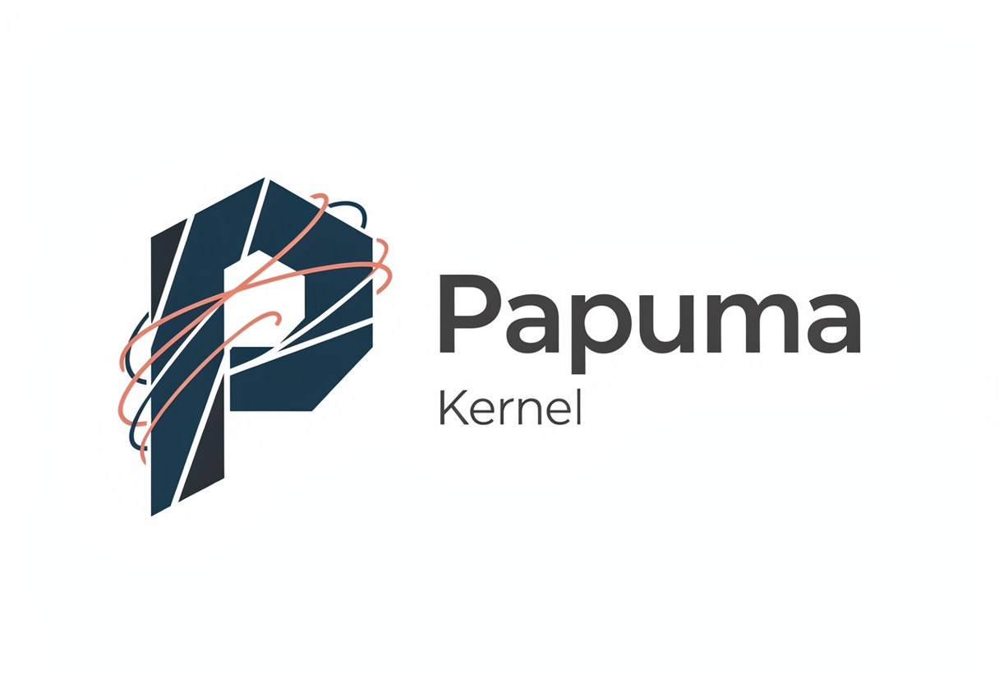

# Papuma Kernel

<p align="center"></p>

<p align="center">
  
  
  
  
</p>

<p align="center"><strong>Your documents are the truth. The change feed follows automatically.</strong></p>

Papuma Kernel is a small, PostgreSQL-native application kernel for .NET 10. You
store plain C# objects as JSON documents; the kernel derives a **reversible
change feed in the same atomic transaction**, applies your **privacy policies
before anything is recorded**, and delivers every change to your handlers
strictly in order. You get what event sourcing promises — a complete, auditable
history and reactive projections — without the replay obligation, the mandatory
event modeling, or the GDPR headache.

This is **document-sourced CQRS**: the document is the source of truth, the feed
is derived from it (never the other way around). One primitive makes it work —
PostgreSQL 18's `RETURNING OLD/NEW` gives the before- and after-state in a single
statement, so there is no outbox to forget and no window in which the diff can
lie.

> **vNEXT (1.0)** — rebuilt from scratch on PostgreSQL ≥ 18; no migration path
> from 0.x (see [CHANGELOG](CHANGELOG.md)). The marketing one-pager with diagrams
> and measured numbers lives in [docs/factsheet.md](docs/factsheet.md).

## Sixty seconds to running

```csharp
builder.Services
    .AddPapumaKernel(o =>
    {
        o.ConnectionString = config.GetConnectionString("papuma");
        o.Model(m => m
            .Document<User>(d => d.UniqueKey(x => x.Email))
            .Event<UserLoggedIn>(e => e.Retention(TimeSpan.FromDays(90))));
    })
    .AddChangeHandler<UserProjection>();

// Write — atomic, versioned, policy-applied, feed included:
await using var session = store.OpenSession(ScopeContext.Tenant("acme"));
await session.SaveAsync(user, expectedVersion: 0);
await session.AppendAsync(new UserLoggedIn(user.Id, "web"));
await session.CommitAsync();
```

Schema, indexes and row-level security are created idempotently at startup.
There is no migration step. There is no step two.

```bash
dotnet build Papuma.Kernel.slnx
dotnet test  Papuma.Kernel.slnx   # integration tests need Docker/Podman (PostgreSQL 18)
```

Learn by building: [docs/vNEXT/tutorial.md](docs/vNEXT/tutorial.md) · terse API tour: [docs/vNEXT/getting-started.md](docs/vNEXT/getting-started.md).

## What ships in the box

- **Atomic write primitives** — versioned Save/Delete, single-statement patches
  (`Set`/`Remove`/`Increment`), set-based bulk ops, append-only rollback, and a
  bounded counter that cannot oversell (proven under 12-way concurrency).
- **Two-layer multi-tenancy** — explicit scope predicates **plus** PostgreSQL
  row-level security; fail-closed (a missing scope yields empty reads, never a
  leak).
- **Privacy by construction** — field policies (`Redact`/`Hash`/`Reference`/
  `DoNotTrack`) applied *inside* the write transaction, so sensitive values never
  reach the feed, the logs, the traces, or AI consumers. The same policies
  project onto masked reads ([ADR-016](docs/vNEXT/adr/adr-016-policy-projected-reads.md)).
- **GDPR tooling** — Art.-30 data inventory from the metamodel, Art.-15/20 subject
  export, history redaction with a mandatory audit trail ([gdpr.md](docs/vNEXT/gdpr.md)).
- **Processing engine** — strict per-handler ordering, persisted checkpoints,
  retry/backoff, poison handling, one-call rebuild, leader failover via
  `FOR UPDATE SKIP LOCKED` — no extra infrastructure.
- **Event log** — first-class facts (`UserLoggedIn`) beside state changes, same
  transaction, same policies, per-type retention.
- **Observability** — BCL `Meter` + `ActivitySource` (zero vendor deps),
  OpenTelemetry-ready, feed-lag health check, and an **embedded live dashboard**
  (`MapPapumaDashboard()`) for the day before Prometheus exists.
- **AI-ready** — an [MCP server](src/Papuma.Kernel.Mcp) over the diagnostics and
  scope-bound, policy-masked reads (read-only by default); the policy-minimized
  feed is safe LLM reading material by construction.

## Packages

| Package | What it is |
|---|---|
| `Papuma.Kernel` | core library — store, diff engine, policies, feeds, hosting |
| `Papuma.Kernel.AspNetCore` | optional ASP.NET Core integration — tenant middleware, feed-lag health check, embedded dashboard |
| `Papuma.Kernel.Mcp` | optional MCP server — read-only diagnostics + masked content tools for agents |

## Samples

| Sample | Shows |
|---|---|
| [shop-minimal-api](samples/shop-minimal-api) | the breadth — a mini shop touching every kernel concept: approval workflows with humans in the loop, saga compensation, inventory that cannot oversell, realtime UI push, the MCP endpoint and the dashboard |
| [event-modeled-slices](samples/event-modeled-slices) | the *shape* — one vertical slice of each Event Modeling type (Command/View/Automation) with a pure, infrastructure-free Decider test |
| [polyglot-consumers](samples/polyglot-consumers) | the feed as a cross-language contract — Python (psycopg3) and Go (pgx) consumers, ~50 lines each |

## Recipes

Pattern guides on kernel primitives ([docs/vNEXT/recipes](docs/vNEXT/recipes)):
[workflow-saga](docs/vNEXT/recipes/workflow-saga.md) ·
[realtime-ui-notifications](docs/vNEXT/recipes/realtime-ui-notifications.md) ·
[external-read-models](docs/vNEXT/recipes/external-read-models.md) (search/vector/cache) ·
[nats-bridge](docs/vNEXT/recipes/nats-bridge.md) ·
[field-level-encryption](docs/vNEXT/recipes/field-level-encryption.md) ·
[event-modeling-slices](docs/vNEXT/recipes/event-modeling-slices.md) ·
[ai-consumers](docs/vNEXT/recipes/ai-consumers.md).

## Documentation map

- **Start:** [tutorial.md](docs/vNEXT/tutorial.md) — build one app end to end (guided) · [getting-started.md](docs/vNEXT/getting-started.md) — the five-minute API tour · marketing one-pager: [factsheet.md](docs/factsheet.md)
- **Architecture:** [architecture.md](docs/vNEXT/architecture.md) · the *why* behind every decision: [concepts.md](docs/vNEXT/concepts.md)
- **Decisions:** [16 ADRs](docs/vNEXT/adr) — each a single, dated, reversible choice
- **Cross-language:** the [feed wire format](docs/vNEXT/feed-wire-format.md) consumers rely on
- **Agents:** [llms.txt](llms.txt) and `docs/ai/` are shipped inside the NuGet package
- Archived 0.x/v1 docs live under `docs/v1`.

## Maturity, stated plainly

`1.0.0-preview` — the design is complete (13 implementation phases, 16 ADRs,
every identified risk closed with a test or a measurement; **167 integration
tests against real PostgreSQL 18, green**), but it has **not yet carried
production traffic**. Best fit today: internal line-of-business systems and new
products built by teams that control their PostgreSQL version. For regulated,
mission-critical workloads, run a pilot first — the observability to judge it is
built in.

## What it deliberately is not

- **Not an ORM or query DSL** — lookups run over declared, indexed keys;
  anything richer is a projection or a SQL view (enforced, not just advised).
- **Not event sourcing** — the document is the truth, the feed is derived.
- **Not database-agnostic** — PostgreSQL ≥ 18, exploited without apology.
- **Not a workflow/BPMN engine** — durable state machines and timers are
  documented patterns on kernel primitives (with running sample code).

## License

MIT — see [LICENSE](LICENSE).
