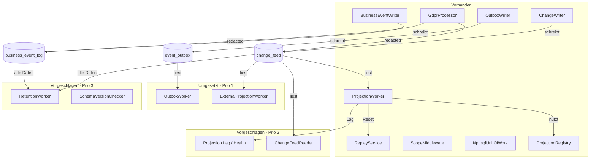

# Framework-Bewertung und Erweiterungsvorschläge

## Gesamteinschätzung

Papuma.Kernel ist ein **überraschend vollständiges und durchdachtes Framework** für seine Größe. Die Architekturentscheidungen sind konsistent, die Abstraktionen sind schlank, und die Implementierung folgt einem klaren Prinzip: *Explizitheit über Magie*.

### Was besonders gut gelungen ist

1. **Scope-Modell als Sicherheitsinvariante** — Die Kombination aus C#-Validierung (`ScopeContext`), SQL-CHECK-Constraints und RLS-Policies bildet eine dreifache Absicherung. Das ist selten so konsequent durchgezogen.

2. **GDPR als First-Class-Concern** — Die meisten Frameworks behandeln DSGVO als Afterthought. Hier ist Redaktion atomar, auditiert, und deckt beide Event-Tabellen ab. `actorId` + `reason` als Pflichtparameter ist eine kluge Designentscheidung.

3. **ProjectionWorker-Qualität** — Visibility Guard (`xmin < pg_snapshot_xmin`), Dead-Letter mit Exponential Backoff, Replay via Channel — das sind produktionsreife Details, die man in vielen größeren Frameworks nicht findet.

4. **Keine unnötigen Abstraktionen** — Kein Repository-Pattern, kein Generic-Host-Magic, kein Auto-Discovery. Der Entwickler sieht genau, was passiert.

---

## Wo das Framework den Entwickler unterstützt — und wo nicht

### Change Feed

| Aspekt | Unterstützung | Bewertung |
|---|---|---|
| Append in Transaktion | `ChangeWriter.AppendAsync()` | ✅ Vollständig |
| Input-Validierung | `InputValidator` mit Regex + Size-Check | ✅ Vollständig |
| Scope + RLS | Automatisches `SET LOCAL` vor jedem Insert | ✅ Vollständig |
| Lesen des Feeds | Nur im `ProjectionWorker` | ⚠️ Kein allgemeiner Reader |
| Schema-Migration | `schema.sql` als Datei | ⚠️ Kein Migrations-Runner |

### Projections

| Aspekt | Unterstützung | Bewertung |
|---|---|---|
| Checkpoint-Management | Automatisch im Worker | ✅ Vollständig |
| Fehlerbehandlung | Dead-Letter + Retry + Backoff | ✅ Vollständig |
| Replay | `ReplayService` + `IReplayableProjection` | ✅ Vollständig |
| Versioned Dispatch | `ProjectionRegistry` | ✅ Vollständig |
| Externe Projektionen | `IExternalProjectionHandler` + `ExternalProjectionWorker` | ✅ Vollständig |
| Projection-Monitoring | Kein Health-Check / Lag-Metrik | ❌ Fehlt |

### GDPR

| Aspekt | Unterstützung | Bewertung |
|---|---|---|
| Art. 17 Redaktion | Atomar, beide Tabellen, auditiert | ✅ Vollständig |
| Art. 15 Auskunft | Beide Tabellen, inkl. redacted | ✅ Vollständig |
| Read-Model-Bereinigung | Nicht im Kernel | ⚠️ Bewusst, aber dokumentiert |
| Retention Policy | Nur als SQL-Beispiel in der Doku | ⚠️ Kein Automatismus |

### Outbox

| Aspekt | Unterstützung | Bewertung |
|---|---|---|
| Enqueue in Transaktion | `OutboxWriter.EnqueueAsync()` | ✅ Vollständig |
| Publisher-Interface | `IOutboxPublisher` | ✅ Definiert |
| Dispatch-Worker | `OutboxWorker` + `AddOutboxWorker<TPublisher>()` | ✅ Vollständig |

### Multi-Tenancy

| Aspekt | Unterstützung | Bewertung |
|---|---|---|
| Shared DB + RLS | Schema + Writer-Integration | ✅ Vollständig |
| Database-per-Tenant | `ScopeDataSourceFactory` | ✅ Vollständig |
| Scope-Resolution (HTTP) | `ScopeMiddleware` + `IScopeResolver` | ✅ Vollständig |

---

## Erweiterungsvorschläge — priorisiert

> Status 2026-06-05: Priorität 1 ist umgesetzt (`OutboxWorker`, `ExternalProjectionWorker`).

### Priorität 1: Hoher Nutzen, geringer Aufwand (umgesetzt)

#### 1a. OutboxWorker — Polling-Dispatcher für die Outbox

**Status:** Umgesetzt. Die Outbox hat jetzt einen `OutboxWorker`, der Einträge aus `event_outbox` pollt und über `IOutboxPublisher.PublishAsync(...)` zustellt.

**Umsetzung:** `OutboxWorker : BackgroundService` analog zum `ProjectionWorker`:
- Pollt `event_outbox` mit `status IN ('Pending', 'Failed')`, `next_retry_at <= NOW()`, `attempts < MaxAttempts`
- Ruft `IOutboxPublisher.PublishAsync(scope, eventId, eventType, payloadJson, ct)` auf
- Setzt `status = 'Sent'` bei Erfolg, erhöht bei Fehlern `attempts`, setzt `status = 'Failed'`, `last_error` und `next_retry_at`
- Exponential Backoff analog zu Projections
- Dead-Letter via Max-Attempts-Grenze

**Aufwand:** Erledigt.

```
┌─────────────────────────────────────────────┐
│              OutboxWorker                   │
│                                             │
│  Poll: event_outbox WHERE Pending/Failed    │
│       ↓                                     │
│  IOutboxPublisher.PublishAsync()            │
│       ↓                                     │
│  status = Sent / Failed + retry             │
└─────────────────────────────────────────────┘
```

#### 1b. ExternalProjectionWorker

**Status:** Umgesetzt. `IExternalProjectionHandler` wird jetzt durch `ExternalProjectionWorker` ausgeführt.

**Umsetzung:** `ExternalProjectionWorker` ruft `IExternalProjectionHandler.HandleAsync(record, ct)` auf, ohne Transaktions-Kopplung in den Handlern, aber mit demselben Checkpoint/Retry-Mechanismus wie beim internen Worker.

**Aufwand:** Erledigt.

---

### Priorität 2: Mittlerer Nutzen, mittlerer Aufwand (umgesetzt)

#### 2a. Projection Health / Lag-Metriken

**Status:** Umgesetzt. Projection-Lag ist jetzt programmatisch verfügbar und optional als Health-Check integrierbar.

**Umsetzung:**
- `ProjectionWorker` und `ExternalProjectionWorker` implementieren `IProjectionLagProvider` und liefern `ProjectionLagSnapshot` (Checkpoint, LatestSequenceId, Lag)
- Optionale ASP.NET-Core-Integration via `AddPapumaProjectionHealthChecks(...)` + `ProjectionLagHealthCheck`
- Optionales Metrics-Instrumenting via `System.Diagnostics.Metrics` bleibt als separater Ausbaupunkt offen

#### 2b. Change Feed Reader (allgemein)

**Status:** Umgesetzt. Für Ad-hoc-Abfragen gibt es jetzt einen allgemeinen Reader.

**Umsetzung:** `ChangeFeedReader` mit:
- `GetByEntityAsync(scope, entity, entityId)` — alle Events für eine Entity
- `GetBySequenceRangeAsync(scope, from, to)` — Bereich lesen
- `GetLatestSequenceIdAsync()` — aktuellste Sequence

Zusätzlich ist die DI-Registrierung über `AddChangeFeedReader()` sowie über `AddPapumaKernel()` verfügbar.

---

### Priorität 3: Sinnvoll, aber nicht dringend

#### 3a. Schema-Migrations-Unterstützung

**Problem:** `schema.sql` ist eine einzelne Datei. Bei Schema-Änderungen (z.B. neue Spalten) gibt es keinen Migrationspfad.

**Vorschlag:** Kein eigenes Migrations-Framework, aber:
- Versionierte SQL-Dateien (`V001__initial.sql`, `V002__add_scope.sql`)
- Ein `SchemaVersionChecker` der prüft, ob die DB auf dem erwarteten Stand ist
- Dokumentation, wie man das mit FluentMigrator oder dbmate kombiniert

#### 3b. Retention-Policy-Automatisierung

**Problem:** Retention ist nur als SQL-Beispiel dokumentiert. Für regulierte Systeme wäre ein automatisierter Prozess sinnvoll.

**Vorschlag:** Ein `RetentionWorker : BackgroundService` der konfigurierbar alte, bereits redacted Events physisch löscht oder archiviert.

#### 3c. Idempotenz-Unterstützung für den Change Feed

**Problem:** Wenn ein Entwickler `ChangeWriter.AppendAsync()` versehentlich zweimal aufruft (z.B. bei Retry auf Application-Ebene), entsteht ein Duplikat im Feed.

**Vorschlag:** Optionaler Idempotency-Key (z.B. `correlation_id` + `event_type` als Unique Constraint). Nicht als Default, sondern als Opt-in.

---

### Was man bewusst NICHT ergänzen sollte

| Idee | Warum nicht |
|---|---|
| Auto-Discovery von Projections | Widerspricht dem Explizitheitsprinzip |
| Generic Repository über dem Change Feed | Unnötige Abstraktion |
| Eigenes Migrations-Framework | Besser auf bestehende Tools verweisen |
| Snapshot-Mechanismus | Nicht nötig bei CRUD-Truth-Modell |
| Event-Upcasting-Pipeline | Bewusst ausgeschlossen, `ProjectionRegistry` reicht |
| Message-Broker-Integration im Kernel | Gehört in die Anwendungsschicht |

---

## Architektur-Diagramm: Ist-Zustand vs. Erweiterungen



---

## Fazit

Das Framework ist in seinem Kern **produktionsreif und architektonisch sauber**. Nach der Umsetzung von Priorität 1 sind die wichtigsten verbleibenden Lücken:

1. **Projection-Monitoring** — in Produktion unverzichtbar
2. **Change Feed Reader** — hilfreich für Admin/Debug/Export
3. **Schema-Migrationspfad** — sinnvoll bei evolutionären Änderungen

Die umgesetzten Erweiterungen folgen dem bestehenden Pattern des `ProjectionWorker` und erfordern keine Architekturänderung. Damit wurde das Framework vollständiger, ohne unnötige Komplexität einzuführen.
