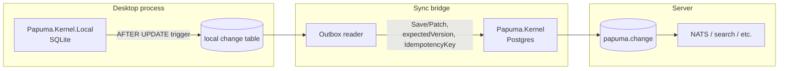

# Exploration: a SQLite-backed sibling for desktop/local use

Status: **exploration confirmed as worth pursuing** (2026-08-11, updated same
day). Started as a pure idea; there is now a concrete desktop project that
could use it, so this has moved from "captured for later" to "next up."
Section 7 lays out the implementation sequencing. Companion to
[offline-sync-and-projection-conflicts.md](offline-sync-and-projection-conflicts.md)
(the sync/conflict side of the same question) and to
[chat-2.md](../chats/chat-2.md) (the original brainstorm this grew out of).

Origin: while building a desktop application on Papuma Kernel, a Postgres
server started to feel like overkill for a single-user local store —
which reopened, almost verbatim, the DB-agnostic-core idea that
[ADR-001](../vNEXT/adr/adr-001-postgresql-18-only.md) already considered and
rejected (`chat-1.md` → `IStorageProvider` with Postgres/SQL Server
providers). This document works out why the desktop use case is *not* the
same proposal ADR-001 turned down, and what a version of it that respects
ADR-001's reasoning would actually look like.

**The desired outcome, stated up front:** Postgres stays the unconditional
default for server applications — nothing here touches that. Desktop
applications *optionally* get a local SQLite store with the same conceptual
model, syncable to a central Postgres later. Working title:
`Papuma.Kernel` (server) and `Papuma.Kernel.Local` (desktop) as **siblings**,
not `Papuma.Kernel` with a storage provider switch.

---

## 1. Why this doesn't reopen ADR-001

ADR-001's objection was specific: a **shared storage abstraction**
(`IStorageProvider`, one code path serving multiple SQL engines) forces the
design down to whichever engine has the weakest feature set, or grows
per-provider special cases inside supposedly-shared code — diluting the
Postgres implementation for the benefit of a provider nobody uses yet. Quote
from the ADR: *"A provider abstraction would have to flatten all of this to
the lowest common denominator or maintain special paths per provider — both
dilute the design before a single user for a second provider exists."*

What's proposed here is a different shape entirely:

| | ADR-001's rejected proposal | This proposal |
|---|---|---|
| Code | One kernel, `IStorageProvider` branches inside | Two independent kernels, one shared core library |
| SQL | Shared/abstracted | Each engine's SQL is exactly as native as today's Postgres kernel |
| What's shared | Storage implementation | The **data contract** (`ChangeRecord`, diff shape) *and* the storage-neutral business logic (diff engine, policies, upcasting) — see §3 |
| Risk to Postgres kernel | Real — every abstraction leaks back | Low — `Papuma.Kernel`'s SQL/session code stays where it is; only the parts that are already storage-neutral move to a shared project |

Sharing a *data contract* is not a new idea invented for this document — it's
literally what [feed-wire-format.md](../vNEXT/feed-wire-format.md) already
does for polyglot consumers (concepts §21): a stable, storage-neutral spec
for what a change record looks like, so any language can consume the feed
without touching Postgres internals. This proposal reuses the same posture
one level further: instead of only *consuming* that shape from a foreign
language, *produce* it from a second, independent storage engine.

## 2. The contract is largely already storage-neutral

Checked against the current code, not just the docs — `ChangeRecord`
([src/Papuma.Kernel/Changes/ChangeRecord.cs](../../src/Papuma.Kernel/Changes/ChangeRecord.cs))
is already a plain C# record: `Seq`, `Scope`, `DocumentType`, `DocumentId`,
`Version`, `SchemaVersion`, `Operation`, `Diff` (a `DocumentDiff` of
`System.Text.Json.Nodes` values), `ActorId`, `Metadata`, `OccurredAt`. No
`Npgsql` type appears in its shape. Combined with the wire-format spec's diff
format (§3: `{old, new}` / `{changed}` / `{ref}` per field path, policy-aware
and reversible), the contract a `Papuma.Kernel.Local` would need to speak is
not hypothetical — it is what already ships today, just not yet pulled out
as an artifact independent of the Postgres kernel's assembly.

## 3. How much code would actually need to be duplicated

The worry ("won't this mean a ton of duplicate code?") is reasonable to raise
and deserved a real answer instead of a hand-wave — so: measured against the
current kernel, not guessed.

```
Total .cs files in src/Papuma.Kernel:        76
Files that reference Npgsql at all:          18   (24%)
```

Broken down by folder, `Npgsql`-touching files vs. total:

| Folder | Files | Touch `Npgsql` |
|---|---|---|
| `Changes/` (diff engine, `ChangeRecord`, policies) | 9 | **0** |
| `Model/` | 10 | **0** |
| `Validation/` | 1 | **0** |
| `Store/` | 23 | 7 (the rest are exceptions/result types) |
| `Events/` | 5 | 2 |
| `Gdpr/` | 5 | 1 |
| `Processing/` | 6 | 2 |
| `Tenancy/` | 6 | 3 |
| `Hosting/` | 4 | 3 |
| `Diagnostics/` | 1 | 0 |

Three folders are **100% storage-neutral today**: the diff engine, the
policy engine, upcasting-relevant model types, and validation never touch
Postgres. Even inside `Store/` — where the real write path lives — most files
(`BulkResult`, `ConcurrencyException`, `DocumentResult`, `PatchBuilder`,
`SaveResult`, the typed exceptions) are plain types. The `Npgsql` references
concentrate almost entirely in the `DocumentSession.*` files — unsurprising,
since that's literally the code that talks to the database.

**Conclusion: the expensive, correctness-critical logic — diffing, policy
application, schema upcasting, validation, the `ChangeRecord`/`DocumentDiff`
types — is already shared by construction.** What's left over for
`Papuma.Kernel.Local` to write natively is the narrow slice that has to
differ by definition: connection/transaction handling, the atomic write
mechanism (`RETURNING OLD/NEW` vs. an `AFTER UPDATE` trigger), the
concurrency check, DDL. That slice isn't "duplication" in the bad sense
(the same logic typed out twice) — it's two different, necessarily different
implementations of a small write-path contract. No abstraction, however
clever, makes that part smaller: even inside a shared `IStorageProvider` it
would still be two full SQL implementations underneath, just addressed
indirectly.

### The narrow storage seam

The refinement worth making explicit: rather than "two kernels that happen to
produce the same JSON shape" (implying the session/orchestration layer above
storage gets written twice too), the shared library should include the
**orchestration**, not just the DTOs — "compute diff → apply policies →
validate → hand off to storage → build `ChangeRecord`" is pure C# and belongs
in one place. Only the actual persistence call is behind a small seam:

```csharp
// illustrative — not a proposal to design in the abstract, see §7
internal interface IDocumentStorage
{
    Task<(JsonObject? Old, JsonObject New, long Version)> WriteAsync(
        DocumentKey key, JsonObject data, long expectedVersion, ChangeOperation op, CancellationToken ct);

    Task AppendChangeAsync(ChangeRecord record, CancellationToken ct);

    IAsyncEnumerable<ChangeRecord> ReadChangesAsync(long afterSeq, CancellationToken ct);
}
```

Three, maybe four methods. This is deliberately **not** the interface ADR-001
rejected: it doesn't try to abstract "a document database" in general, it
abstracts exactly the handful of operations that `DocumentSession` already
performs against Postgres today — narrow enough that it can't flatten to a
lowest common denominator, because there isn't much to flatten. And critically,
it gets designed *from* a second real, working implementation (the SQLite one
being built now), not guessed at in advance — which is exactly the order
ADR-001's own consequence recommends: *"extracting an abstraction from a
working Postgres implementation is easier than the reverse approach."*

The SQLite side should still be **radically simpler** than the Postgres
kernel where it's allowed to be — no RLS/scope machinery, no
snapshot-visibility handling (§4), in-process notification instead of
LISTEN/NOTIFY. Simpler storage adapter, same shared orchestration above it.

## 4. Why the hardest Postgres problem mostly disappears here

[ADR-010](../vNEXT/adr/adr-010-feed-consumption.md)'s entire "seq visibility
gap" mechanism (`txid8`, `pg_snapshot_xmin`) exists to solve one problem:
**multiple concurrent writers** whose transaction-commit order can cross
their seq-assignment order. An embedded SQLite database inside a single
desktop process has, for all practical purposes, exactly one writer — the
application itself, serialized through SQLite's own write lock. The problem
ADR-010 solves essentially doesn't arise in that topology. A local feed
reader can be close to `WHERE seq > @checkpoint ORDER BY seq` — no snapshot
gymnastics needed.

What SQLite *doesn't* give you natively (and `chat-2.md`'s own analysis
already gets this right): no `RETURNING OLD/NEW` — old/new capture has to
happen via `AFTER UPDATE/DELETE` triggers instead, writing into a
`changefeed`/`change` table in the same SQLite transaction. Functionally
equivalent (same atomicity guarantee: document write and change record commit
or roll back together), mechanically different. That's fine — it's exactly
the kind of difference this document says is okay to have per engine.

## 5. The sync bridge

Connecting the two is not a new mechanism to invent here — it's
[offline-sync-and-projection-conflicts.md](offline-sync-and-projection-conflicts.md)'s
Idea A (local outbox, replay against the central Postgres with a remembered
`expectedVersion`, conflict resolution policy, `AppendEventAsync` for audit).
One rule from [feed-wire-format.md §6](../vNEXT/feed-wire-format.md#6-writing)
carries over unchanged and matters here specifically: *"Foreign consumers are
consumers... writes go through the kernel's session — never `INSERT` into
`papuma.document`/`change`/`event` directly."* The sync process pushing local
SQLite changes up to the server is exactly such a foreign consumer — it calls
`Save`/`Patch` like any other client, never touches Postgres tables directly.
No exception to that rule needs inventing for this case.



The sync bridge is deliberately **not** part of the first build — see §7.
Nothing about it blocks shipping the local SQLite kernel standalone first.

## 6. Proposed shape

- **`Papuma.Kernel`** — Postgres session/storage code stays exactly where it
  is; it starts referencing the new shared project instead of containing the
  logic directly, but its public surface and behavior don't change.
- **`Papuma.Kernel.Core`** (naming tentative) — new project holding what §3
  already showed is storage-neutral: `Changes/`, `Model/`, `Validation/`,
  the diff engine, policy engine, upcasting, `ChangeRecord`/`DocumentDiff`,
  and the session-level orchestration (Save/Patch semantics) written once
  against `IDocumentStorage`. This is a **refactor of existing code**, not
  new code — moving files, not rewriting logic.
- **`Papuma.Kernel.Local`** — new project. SQLite storage implementing
  `IDocumentStorage`: trigger-based old/new capture, single-writer feed
  reader, in-process change notification, no RLS/scope machinery.
- **The sync bridge** — a later, separate package once the SQLite kernel
  itself is proven; consumes `Papuma.Kernel.Local`'s feed, calls
  `Papuma.Kernel`'s API like any client.

## 7. Implementation sequencing

This is confirmed as next-up work now (a live desktop project can use it),
so the order matters:

1. **Extract `Papuma.Kernel.Core`.** Move the already-storage-neutral code
   (§3's zero-`Npgsql` folders plus the non-`Npgsql` files in `Store/`) into
   its own project; `Papuma.Kernel` references it. This is pure refactor
   risk (moving/renaming, adjusting namespaces and references), not design
   risk — the boundary is already known from the file-level evidence above.
   Verify with the existing test suite; behavior must not change.
2. **Design `IDocumentStorage` from what `DocumentSession` already does.**
   Don't design it in the abstract — read off the exact operations the
   Postgres session performs (write+diff-capture, change append, checkpointed
   read) and shape the seam to match, per §3.
3. **Build `Papuma.Kernel.Local`** against that seam: SQLite schema (document
   table + change table), `AFTER UPDATE/DELETE` triggers for old/new capture,
   a feed reader without the snapshot-gap logic (§4), in-process change
   notification.
4. **Prove it standalone first** — no sync bridge yet. A desktop app that
   only ever talks to its local SQLite store is already a complete, useful
   product and the cleanest way to validate the seam and the SQLite session
   without also debugging sync/conflict logic at the same time.
5. **The sync bridge is a distinct, later step** (§5) — build it once there's
   a concrete need to talk to a central Postgres, using
   [offline-sync-and-projection-conflicts.md](offline-sync-and-projection-conflicts.md)'s
   design. Don't pull it into step 1–4's scope.

What stays true from the original version of this document: don't build
speculative multi-tenancy, RLS, or Postgres-parity features into
`Papuma.Kernel.Local` "just in case" — it earns its simplicity from the
single-process, single-user topology (§3, §4). Keep it that simple until a
concrete requirement says otherwise.

## 8. Open questions for the extraction

Worth pinning down before or during step 1, not left implicit:

- **Project/package naming** — `Papuma.Kernel.Core` vs. folding the
  shared code into `Papuma.Kernel` itself with `Papuma.Kernel.Local`
  depending on it directly (skips one project, but then "the Postgres
  package" and "the shared core" are the same NuGet package, which a future
  third storage target would have to live with).
- **`IDocumentStorage`'s exact shape** — the sketch in §3 is illustrative;
  the real signature should fall out of reading `DocumentSession.cs`
  directly, not be designed from this document.
- **Whether policies (ADR-004/007) apply identically on the desktop side**,
  or whether a single-user local store even needs redact/hash/reference —
  plausibly needs less, but that's a product decision, not an architecture
  one.
