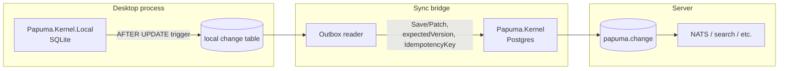

# Exploration: a SQLite-backed sibling for desktop/local use

Status: **idea / not decided** (2026-08-11). No implementation triggered by
this document. Companion to
[offline-sync-and-projection-conflicts.md](offline-sync-and-projection-conflicts.md)
(the sync/conflict side of the same question) and to
[chat-2.md](../chats/chat-2.md) (the original brainstorm this grew out of).

Origin: while building a desktop application on Papuma Kernel, a Postgres
server started to feel like overkill for a single-user local store —
which reopened, almost verbatim, the DB-agnostic-core idea that
[ADR-001](../vNEXT/adr/adr-001-postgresql-18-only.md) already considered and
rejected (`chat-1.md` → `IStorageProvider` with Postgres/SQL Server
providers). This document works out why the desktop use case is *not* the
same proposal ADR-001 turned down, and what a version of it that respects
ADR-001's reasoning would actually look like.

**The desired outcome, stated up front:** Postgres stays the unconditional
default for server applications — nothing here touches that. Desktop
applications *optionally* get a local SQLite store with the same conceptual
model, syncable to a central Postgres later. Working title:
`Papuma.Kernel` (server) and `Papuma.Kernel.Local` (desktop) as **siblings**,
not `Papuma.Kernel` with a storage provider switch.

---

## 1. Why this doesn't reopen ADR-001

ADR-001's objection was specific: a **shared storage abstraction**
(`IStorageProvider`, one code path serving multiple SQL engines) forces the
design down to whichever engine has the weakest feature set, or grows
per-provider special cases inside supposedly-shared code — diluting the
Postgres implementation for the benefit of a provider nobody uses yet. Quote
from the ADR: *"A provider abstraction would have to flatten all of this to
the lowest common denominator or maintain special paths per provider — both
dilute the design before a single user for a second provider exists."*

What's proposed here is a different shape entirely:

| | ADR-001's rejected proposal | This proposal |
|---|---|---|
| Code | One kernel, `IStorageProvider` branches inside | Two independent kernels |
| SQL | Shared/abstracted | Each engine's SQL is exactly as native as today's Postgres kernel |
| What's shared | Storage implementation | Only the **data contract at the boundary** — the shape of a document, a version, a diff, a `ChangeRecord` |
| Risk to Postgres kernel | Real — every abstraction leaks back | None — `Papuma.Kernel` is untouched |

Sharing a *data contract* is not a new idea invented for this document — it's
literally what [feed-wire-format.md](../vNEXT/feed-wire-format.md) already
does for polyglot consumers (concepts §21): a stable, storage-neutral spec
for what a change record looks like, so any language can consume the feed
without touching Postgres internals. This proposal reuses the same posture
one level further: instead of only *consuming* that shape from a foreign
language, *produce* it from a second, independent storage engine.

## 2. The contract is largely already storage-neutral

Checked against the current code, not just the docs — `ChangeRecord`
([src/Papuma.Kernel/Changes/ChangeRecord.cs](../../src/Papuma.Kernel/Changes/ChangeRecord.cs))
is already a plain C# record: `Seq`, `Scope`, `DocumentType`, `DocumentId`,
`Version`, `SchemaVersion`, `Operation`, `Diff` (a `DocumentDiff` of
`System.Text.Json.Nodes` values), `ActorId`, `Metadata`, `OccurredAt`. No
`Npgsql` type appears in its shape. Combined with the wire-format spec's diff
format (§3: `{old, new}` / `{changed}` / `{ref}` per field path, policy-aware
and reversible), the contract a `Papuma.Kernel.Local` would need to speak is
not hypothetical — it is what already ships today, just not yet pulled out
as an artifact independent of the Postgres kernel's assembly.

## 3. What's shared vs. what's deliberately not

| | Shared | Not shared |
|---|---|---|
| Diff format (wire-format §3) | ✅ already storage-neutral | |
| `ChangeRecord`/`DocumentDiff` shape | ✅ already a plain POCO | |
| API verbs and their semantics (`Save(doc, expectedVersion)`, `Patch(...)`, `GetChanges(afterSeq)`) | ✅ same developer experience on both | |
| Write-path SQL (`RETURNING OLD/NEW` vs. a trigger) | | ✅ each engine's native mechanism |
| Concurrency/visibility mechanism (`txid8` + snapshot gap, ADR-010) | | ✅ see §4 — mostly doesn't apply to SQLite |
| Multi-tenant scope / RLS | | ✅ a local desktop store has one user; this machinery would be dead weight |
| Feed wakeup (LISTEN/NOTIFY) | | ✅ in-process events suffice in an embedded, single-process store |
| Policies (redact/hash/reference, ADR-004/007) | Conceptually — a desktop app may still want e.g. `[Hash]` on a local field | Implementation, if needed, is separate |

The SQLite side should be **radically simpler** than the Postgres kernel, not
a smaller copy of it. That was the original instinct in `chat-2.md`
("Postgres is overkill for desktop") and it stays correct — it just applies
to the storage engine, not to the conceptual model.

## 4. Why the hardest Postgres problem mostly disappears here

[ADR-010](../vNEXT/adr/adr-010-feed-consumption.md)'s entire "seq visibility
gap" mechanism (`txid8`, `pg_snapshot_xmin`) exists to solve one problem:
**multiple concurrent writers** whose transaction-commit order can cross
their seq-assignment order. An embedded SQLite database inside a single
desktop process has, for all practical purposes, exactly one writer — the
application itself, serialized through SQLite's own write lock. The problem
ADR-010 solves essentially doesn't arise in that topology. A local feed
reader can be close to `WHERE seq > @checkpoint ORDER BY seq` — no snapshot
gymnastics needed.

What SQLite *doesn't* give you natively (and `chat-2.md`'s own analysis
already gets this right): no `RETURNING OLD/NEW` — old/new capture has to
happen via `AFTER UPDATE/DELETE` triggers instead, writing into a
`changefeed`/`change` table in the same SQLite transaction. Functionally
equivalent (same atomicity guarantee: document write and change record commit
or roll back together), mechanically different. That's fine — it's exactly
the kind of difference this document says is okay to have per engine.

## 5. The sync bridge

Connecting the two is not a new mechanism to invent here — it's
[offline-sync-and-projection-conflicts.md](offline-sync-and-projection-conflicts.md)'s
Idea A (local outbox, replay against the central Postgres with a remembered
`expectedVersion`, conflict resolution policy, `AppendEventAsync` for audit).
One rule from [feed-wire-format.md §6](../vNEXT/feed-wire-format.md#6-writing)
carries over unchanged and matters here specifically: *"Foreign consumers are
consumers... writes go through the kernel's session — never `INSERT` into
`papuma.document`/`change`/`event` directly."* The sync process pushing local
SQLite changes up to the server is exactly such a foreign consumer — it calls
`Save`/`Patch` like any other client, never touches Postgres tables directly.
No exception to that rule needs inventing for this case.

## 6. Proposed shape (if this ever gets built)

- **`Papuma.Kernel`** — unchanged. No provider switch, no conditional code
  path, nothing added for this idea's sake.
- **`Papuma.Kernel.Local`** (naming tentative — `.Desktop`/`.Embedded` also
  read fine) — new, independent package. SQLite storage, trigger-based
  old/new capture, single-writer feed reader, in-process change notification,
  no RLS/scope machinery. Implements the same verb-level surface
  (`Save`/`Patch`/`GetChanges`) so application code reads the same either way.
- **The shared contract** — mostly already exists (`ChangeRecord`,
  `DocumentDiff`, the wire-format diff shape). Whether it needs its own
  package (`Papuma.Kernel.Contracts`) or can stay where it is and simply be
  referenced is an implementation detail to decide when this is actually
  built, not now.
- **The sync bridge** — a consumer of `Papuma.Kernel.Local`'s feed and a
  normal client of `Papuma.Kernel`'s API, per §5.

## 7. What NOT to do now

- **Don't build `Papuma.Kernel.Local` speculatively.** It's a second product
  with its own test matrix, its own edge cases (SQLite locking/WAL behavior,
  file-based backup/migration story) — real, ongoing cost, not a one-off.
- **Don't touch `Papuma.Kernel`** to prepare for this. There is nothing to
  prepare — §2 already shows the contract is close to independent, and
  ADR-001's own consequence applies directly: *"extracting an abstraction
  from a working Postgres implementation is easier than the reverse
  approach."* The Postgres kernel doesn't need to anticipate a sibling that
  doesn't exist yet.
- **Do treat the wire-format contract as worth keeping storage-neutral**
  going forward (i.e. a habit, not a project) — cheap, already mostly true,
  and pays for itself today via the existing polyglot-consumer goal
  regardless of whether `Papuma.Kernel.Local` ever gets built.

## 8. Trigger conditions

Same honest uncertainty as the companion document: this is currently a
"could become relevant" idea, not a requirement. Worth revisiting when there
is a concrete desktop deployment that must run fully standalone (no reachable
Postgres at all, not even intermittently) — at that point this document and
[offline-sync-and-projection-conflicts.md](offline-sync-and-projection-conflicts.md)
combine into one build: local SQLite kernel + outbox sync + conflict
resolution policy. If the desktop app turns out fine always talking to a
reachable central Postgres (per the current default), this stays exactly
what it is — an idea on file, not a gap.

If it does get triggered, it deserves its own ADR at that point (a sibling
to ADR-001, not an amendment — ADR-001's "PostgreSQL as the only target
database" decision was and remains correct for the server; a second,
independent decision for the desktop target is a different question, not a
reversal).
