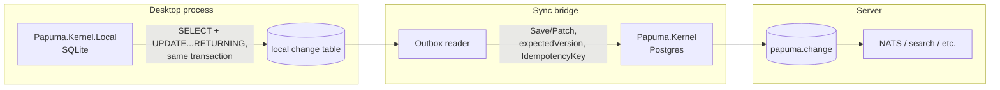

# Exploration: a SQLite-backed sibling for desktop/local use

Status: **built** (2026-08-11). Started as a pure idea, confirmed worth
pursuing the same day once a concrete desktop project needing it existed,
then implemented end to end (Stages 0–5 of §7 all landed): `Papuma.Kernel.Core`
extracted, `Papuma.Kernel.Local` at full parity with `Papuma.Kernel` (Load/
Save/Delete/versioning/diff/change feed, Patch/bulk ops, GDPR redaction,
masked reads, history, rollback, feed processing, hosting), 48 SQLite tests
green alongside the existing 167 Postgres + 4 sample tests. Companion to
[offline-sync-and-projection-conflicts.md](offline-sync-and-projection-conflicts.md)
(the sync/conflict side of the same question — not started, no live
requirement yet) and to [chat-2.md](https://github.com/papumabiz/Papuma.Kernel/blob/master/docs/chats/chat-2.md) (the original
brainstorm this grew out of).

Origin: while building a desktop application on Papuma Kernel, a Postgres
server started to feel like overkill for a single-user local store —
which reopened, almost verbatim, the DB-agnostic-core idea that
[ADR-001](../adr/adr-001-postgresql-18-only.md) already considered and
rejected (`chat-1.md` → `IStorageProvider` with Postgres/SQL Server
providers). This document works out why the desktop use case is *not* the
same proposal ADR-001 turned down, and what a version of it that respects
ADR-001's reasoning would actually look like.

**The desired outcome, stated up front:** Postgres stays the unconditional
default for server applications — nothing here touches that. Desktop
applications *optionally* get a local SQLite store with the same conceptual
model, syncable to a central Postgres later. Working title:
`Papuma.Kernel` (server) and `Papuma.Kernel.Local` (desktop) as **siblings**,
not `Papuma.Kernel` with a storage provider switch.

---

## 1. Why this doesn't reopen ADR-001

ADR-001's objection was specific: a **shared storage abstraction**
(`IStorageProvider`, one code path serving multiple SQL engines) forces the
design down to whichever engine has the weakest feature set, or grows
per-provider special cases inside supposedly-shared code — diluting the
Postgres implementation for the benefit of a provider nobody uses yet. Quote
from the ADR: *"A provider abstraction would have to flatten all of this to
the lowest common denominator or maintain special paths per provider — both
dilute the design before a single user for a second provider exists."*

What's proposed here is a different shape entirely:

| | ADR-001's rejected proposal | This proposal |
|---|---|---|
| Code | One kernel, `IStorageProvider` branches inside | Two independent kernels, one shared core library |
| SQL | Shared/abstracted | Each engine's SQL is exactly as native as today's Postgres kernel |
| What's shared | Storage implementation | The **data contract** (`ChangeRecord`, diff shape) *and* the storage-neutral business logic (diff engine, policies, upcasting) — see §3 |
| Risk to Postgres kernel | Real — every abstraction leaks back | Low — `Papuma.Kernel`'s SQL/session code stays where it is; only the parts that are already storage-neutral move to a shared project |

Sharing a *data contract* is not a new idea invented for this document — it's
literally what [feed-wire-format.md](../feed-wire-format.md) already
does for polyglot consumers (concepts §21): a stable, storage-neutral spec
for what a change record looks like, so any language can consume the feed
without touching Postgres internals. This proposal reuses the same posture
one level further: instead of only *consuming* that shape from a foreign
language, *produce* it from a second, independent storage engine.

## 2. The contract is largely already storage-neutral

Checked against the current code, not just the docs — `ChangeRecord`
([src/Papuma.Kernel/Changes/ChangeRecord.cs](https://github.com/papumabiz/Papuma.Kernel/blob/master/src/Papuma.Kernel.Core/Changes/ChangeRecord.cs))
is already a plain C# record: `Seq`, `Scope`, `DocumentType`, `DocumentId`,
`Version`, `SchemaVersion`, `Operation`, `Diff` (a `DocumentDiff` of
`System.Text.Json.Nodes` values), `ActorId`, `Metadata`, `OccurredAt`. No
`Npgsql` type appears in its shape. Combined with the wire-format spec's diff
format (§3: `{old, new}` / `{changed}` / `{ref}` per field path, policy-aware
and reversible), the contract a `Papuma.Kernel.Local` would need to speak is
not hypothetical — it is what already ships today, just not yet pulled out
as an artifact independent of the Postgres kernel's assembly.

## 3. How much code would actually need to be duplicated

The worry ("won't this mean a ton of duplicate code?") is reasonable to raise
and deserved a real answer instead of a hand-wave — so: measured against the
current kernel, not guessed.

```
Total .cs files in src/Papuma.Kernel:        76
Files that reference Npgsql at all:          18   (24%)
```

Broken down by folder, `Npgsql`-touching files vs. total:

| Folder | Files | Touch `Npgsql` |
|---|---|---|
| `Changes/` (diff engine, `ChangeRecord`, policies) | 9 | **0** |
| `Model/` | 10 | **0** |
| `Validation/` | 1 | **0** |
| `Store/` | 23 | 7 (the rest are exceptions/result types) |
| `Events/` | 5 | 2 |
| `Gdpr/` | 5 | 1 |
| `Processing/` | 6 | 2 |
| `Tenancy/` | 6 | 3 |
| `Hosting/` | 4 | 3 |
| `Diagnostics/` | 1 | 0 |

Three folders are **100% storage-neutral today**: the diff engine, the
policy engine, upcasting-relevant model types, and validation never touch
Postgres. Even inside `Store/` — where the real write path lives — most files
(`BulkResult`, `ConcurrencyException`, `DocumentResult`, `PatchBuilder`,
`SaveResult`, the typed exceptions) are plain types. The `Npgsql` references
concentrate almost entirely in the `DocumentSession.*` files — unsurprising,
since that's literally the code that talks to the database.

**Conclusion: the expensive, correctness-critical logic — diffing, policy
application, schema upcasting, validation, the `ChangeRecord`/`DocumentDiff`
types — is already shared by construction.** What's left over for
`Papuma.Kernel.Local` to write natively is the narrow slice that has to
differ by definition: connection/transaction handling, the atomic write
mechanism (`RETURNING OLD/NEW` vs. an `AFTER UPDATE` trigger), the
concurrency check, DDL. That slice isn't "duplication" in the bad sense
(the same logic typed out twice) — it's two different, necessarily different
implementations of a small write-path contract. No abstraction, however
clever, makes that part smaller: even inside a shared `IStorageProvider` it
would still be two full SQL implementations underneath, just addressed
indirectly.

### The narrow storage seam

The refinement worth making explicit: rather than "two kernels that happen to
produce the same JSON shape" (implying the session/orchestration layer above
storage gets written twice too), the shared library should include the
**orchestration**, not just the DTOs — "compute diff → apply policies →
validate → hand off to storage → build `ChangeRecord`" is pure C# and belongs
in one place. Only the actual persistence call is behind a small seam:

```csharp
// illustrative — not a proposal to design in the abstract, see §7
internal interface IDocumentStorage
{
    Task<(JsonObject? Old, JsonObject New, long Version)> WriteAsync(
        DocumentKey key, JsonObject data, long expectedVersion, ChangeOperation op, CancellationToken ct);

    Task AppendChangeAsync(ChangeRecord record, CancellationToken ct);

    IAsyncEnumerable<ChangeRecord> ReadChangesAsync(long afterSeq, CancellationToken ct);
}
```

Three, maybe four methods. This is deliberately **not** the interface ADR-001
rejected: it doesn't try to abstract "a document database" in general, it
abstracts exactly the handful of operations that `DocumentSession` already
performs against Postgres today — narrow enough that it can't flatten to a
lowest common denominator, because there isn't much to flatten. And critically,
it gets designed *from* a second real, working implementation (the SQLite one
being built now), not guessed at in advance — which is exactly the order
ADR-001's own consequence recommends: *"extracting an abstraction from a
working Postgres implementation is easier than the reverse approach."*

The SQLite side should still be **radically simpler** than the Postgres
kernel where it's allowed to be — no RLS/scope machinery, no
snapshot-visibility handling (§4), in-process notification instead of
LISTEN/NOTIFY. Simpler storage adapter, same shared orchestration above it.

## 4. Why the hardest Postgres problem mostly disappears here

[ADR-010](../adr/adr-010-feed-consumption.md)'s entire "seq visibility
gap" mechanism (`txid8`, `pg_snapshot_xmin`) exists to solve one problem:
**multiple concurrent writers** whose transaction-commit order can cross
their seq-assignment order. An embedded SQLite database inside a single
desktop process has, for all practical purposes, exactly one writer — the
application itself, serialized through SQLite's own write lock. The problem
ADR-010 solves essentially doesn't arise in that topology. A local feed
reader can be close to `WHERE seq > @checkpoint ORDER BY seq` — no snapshot
gymnastics needed.

What SQLite *doesn't* give you natively: no `RETURNING OLD/NEW`. `chat-2.md`'s
original guess was DB triggers; what actually got built instead (simpler, no
SQL-side logic to maintain) is a plain `SELECT` for the "old" state followed
by a version-checked `UPDATE ... RETURNING` for the "new" state, both inside
the same exclusive transaction — two application-level statements instead of
one, same atomicity guarantee (nothing can change the row between them; the
whole point of "single writer" is that there's no one else who could).
Deletes stay a single statement (`DELETE ... RETURNING` naturally returns the
deleted row — no old/new split needed there at all). Mechanically different
from Postgres, functionally equivalent — exactly the kind of difference this
document says is okay to have per engine.

## 5. The sync bridge

Connecting the two is not a new mechanism to invent here — it's
[offline-sync-and-projection-conflicts.md](offline-sync-and-projection-conflicts.md)'s
Idea A (local outbox, replay against the central Postgres with a remembered
`expectedVersion`, conflict resolution policy, `AppendEventAsync` for audit).
One rule from [feed-wire-format.md §6](../feed-wire-format.md#6-writing)
carries over unchanged and matters here specifically: *"Foreign consumers are
consumers... writes go through the kernel's session — never `INSERT` into
`papuma.document`/`change`/`event` directly."* The sync process pushing local
SQLite changes up to the server is exactly such a foreign consumer — it calls
`Save`/`Patch` like any other client, never touches Postgres tables directly.
No exception to that rule needs inventing for this case.



The sync bridge is deliberately **not** part of the first build — see §7.
Nothing about it blocks shipping the local SQLite kernel standalone first.
(Still true as of the build below: the sync bridge remains unbuilt, no live
requirement for it yet.)

## 6. Shape (as built)

- **`Papuma.Kernel`** — untouched behaviorally. Its session/storage code now
  references `Papuma.Kernel.Core` instead of containing the moved logic
  directly; public surface and behavior didn't change (proven by the full
  existing Postgres test suite staying green throughout).
- **`Papuma.Kernel.Core`** — holds everything storage-neutral: `Changes/`,
  `Model/`, `Validation/`, the storage-neutral third of `Tenancy/`, the diff
  engine, policy engine, upcasting, `ChangeRecord`/`DocumentDiff`, the 6
  typed exceptions, `KernelDiagnostics`, `SessionOptions`/`DocumentResult<T>`/
  `SaveResult`/`BulkResult`/`MaskedDocumentResult`, `PatchBuilder`, the
  storage-neutral half of the feed engine (`IChangeHandler`/`IEventHandler`,
  `ChangeFeedProcessorOptions`, `FeedFailure`, `ChangeFeedLagSnapshot`,
  `EventRecord`, `EventPayloadPolicyApplier`, the storage-neutral half of
  `FeedDiagnostics`), and a new `RedactionEngine` (GDPR decision logic,
  extracted from private methods that used to live only in the Postgres
  session). No `IDocumentStorage` interface — see below.
- **`Papuma.Kernel.Local`** — **not** a seam implementation; an independent
  `SqliteDocumentSession`/`SqliteDocumentStore` at full method-for-method
  parity with the Postgres session, calling into Core's diff/policy/model
  code directly. Patch application happens in-process
  (`JsonPatchApplier`, replacing Postgres's generated `jsonb_set` SQL
  expressions) rather than as generated SQL. Its own feed processors
  (`SqliteChangeFeedProcessor`/`SqliteEventFeedProcessor`) and an in-process
  `SqliteChangeNotifier` (replacing LISTEN/NOTIFY) round it out, plus
  `AddPapumaKernelLocal` hosting that mirrors `AddPapumaKernel`'s shape.
- **The sync bridge** — still not built. No live requirement for it yet
  (unchanged from the original version of this document).

## 7. Implementation sequencing (executed)

Landed as six stages, each verified (build + full test suite) before the
next started — see the commit history for exact diffs:

1. **Extracted `Papuma.Kernel.Core`** (two passes — the first extraction, plus
   a second pass in Stage 2 that caught `SessionOptions`/`DocumentResult<T>`/
   `SaveResult`/`BulkResult`/`MaskedDocumentResult`, missed the first time
   despite being equally storage-neutral).
2. **Confirmed no shared storage seam** — see §6's "not a seam
   implementation." Investigated `DocumentSession.*` in full first (Explore +
   Plan agent passes) and found the orchestration and the SQL are more
   tightly interleaved than the folder-level heuristic suggested — building
   `IDocumentStorage` upfront would have meant guessing its shape rather than
   reading it off a second working implementation, the opposite of what
   ADR-001's own consequence recommends.
3. **`Papuma.Kernel.Local` project + SQLite schema + spikes** pinning down
   `RETURNING` behavior, the exact `SqliteException` shape on a unique-index
   violation, and that `SqliteTransaction` has no savepoint API (raw SQL
   text needed) — all empirically verified before being relied on, not
   assumed.
4. **Core write path** (Load/Save/Delete/versioning/change records/commit).
5. **Remaining surface**: Patch/bulk ops, GDPR redaction, masked reads,
   history, rollback — full parity with the Postgres session's public API.
6. **Feed processing + hosting**, then **closing test-suite gaps**
   (schema evolution/upcasting, schema-manager idempotency, event retention)
   that weren't yet covered by the stage-by-stage test additions.

What stayed true throughout: no speculative multi-tenancy, RLS, or
Postgres-parity features went into `Papuma.Kernel.Local` "just in case" — it
earns its simplicity from the single-process, single-user topology (§3, §4).
The sync bridge from
[offline-sync-and-projection-conflicts.md](offline-sync-and-projection-conflicts.md)
stayed out of scope, exactly as planned — build it only once there's a
concrete requirement for offline/multi-device work against a central
Postgres.

## 8. Open questions from the original version — resolved

- **Project/package naming** — settled as `Papuma.Kernel.Core` /
  `Papuma.Kernel.Local`, kept throughout the build.
- **A shared storage seam's exact shape** — resolved as "don't build one":
  see §6/§7 point 2. `Papuma.Kernel.Local` is a fully independent
  implementation, not a seam consumer.
- **Whether policies (ADR-004/007) apply identically on the desktop side**
  — yes, unchanged: `PolicyApplier`/`PolicyProjector`/`RedactionEngine` are
  Core code, called identically from both sessions. No desktop-specific
  policy behavior was needed or introduced.

## 9. What's next, if anything

`Papuma.Kernel.Local` is built, tested, and packs correctly — it's usable
today by the desktop project that motivated this. Nothing here requires
further work unless a concrete need shows up:

- **The sync bridge** (§5) — only if/when offline work against a central
  Postgres becomes a real requirement, per
  [offline-sync-and-projection-conflicts.md](offline-sync-and-projection-conflicts.md).
- **A dedicated `Papuma.Kernel.Core.Tests` project** (DB-less unit tests
  proving Core has zero storage dependency by construction) — mentioned as a
  "later, once Local exists" idea in the Core-extraction plan; Local exists
  now, but the existing test suites already exercise Core's logic twice
  (once per kernel), which is coverage, just not the fastest possible
  feedback loop. Worth doing when that loop starts to matter, not before.
