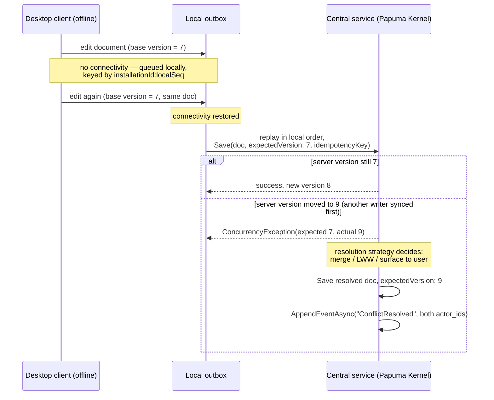
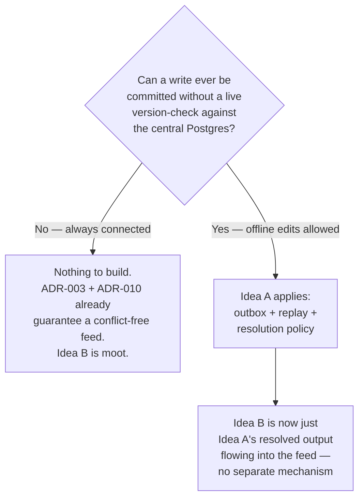

# Exploration: offline-capable clients & multi-user conflicts in projections

Status: **idea / not decided** (2026-08-11). No implementation triggered by this
document — captured so the reasoning doesn't have to be redone if either question
becomes real. Written while designing a desktop application on top of Papuma
Kernel with a central Postgres server; the baseline architecture is: desktop
clients connect live to one shared Postgres, writes go through the kernel's
`Save`/`Patch` API. Companion to
[local-kernel-sqlite-sibling.md](local-kernel-sqlite-sibling.md) (the storage
side of the same underlying question: what if a desktop client isn't always
reachable to that Postgres at all).

Two "what if" questions came up in that context:

- **A. What if the desktop app could work offline** (edit locally, sync later)?
- **B. What if several users work on the same project (same tenant) concurrently**,
  and the change feed needs conflict resolution where it's projected into
  services (search index, NATS, etc.)?

Neither is a committed requirement. This document works out what each would
actually cost, and — the more useful finding — how they relate to each other.

---

## 1. The baseline the questions are asked against

With a central Postgres and clients that always write through the kernel
synchronously, conflict handling is **already fully solved** by the existing
design, with nothing left to build:

- [ADR-003](../vNEXT/adr/adr-003-write-path-concurrency.md): every write carries
  `expectedVersion`; a concurrent write loses the race and gets a typed
  `ConcurrencyException`. Lost updates are structurally impossible.
- [ADR-012](../vNEXT/adr/adr-012-partial-updates.md): `Patch` gives explicit,
  deliberate field-level last-writer-wins for the common case of two users
  touching different fields of the same document — not a conflict, by design.
- [ADR-010](../vNEXT/adr/adr-010-feed-consumption.md): the change feed is
  gapless and strictly ordered by transaction commit order. By the time a
  `ChangeRecord` exists, whatever conflict could have happened at write time
  has already been resolved — the feed is **linearized history**, not a set of
  competing proposals.

The consequence matters for question B in particular, so it's worth stating
explicitly:

> **A projection consumer (NATS, search index, cache) never sees a conflict,
> because none survives to the feed.** Conflicts are resolved once, at the
> `Save`/`Patch` call, inside the transaction that produces the ChangeRecord.
> Everything downstream — including the [NATS bridge](../vNEXT/recipes/nats-bridge.md)
> — consumes an already-decided, totally ordered stream.

This is the load-bearing fact for the rest of the document: **the two
questions are not symmetric.** Question A describes a real gap in the current
architecture. Question B, as literally stated ("conflicts in the projection
layer"), turns out not to be a distinct problem at all *as long as clients stay
connected* — see §4.

---

## 2. Idea A — offline-capable desktop clients

### 2.1 What actually breaks

Optimistic concurrency (ADR-003) requires a round-trip: read version → write
with `expectedVersion`. Offline, there is no server to check against. A local
edit either:

- can't be saved until reconnection (not "offline capable" in any useful
  sense), or
- gets committed locally against a version the client *remembers*, with no
  guarantee that version is still current once connectivity returns.

The second option is what "offline-capable" actually means, and it reopens
exactly the window ADR-003 was built to close — just moved from milliseconds
(network round-trip) to potentially days (a laptop closed over a weekend).

### 2.2 What already exists to build on

Nothing here needs a kernel change — every primitive already exists:

| Need | Existing primitive |
|---|---|
| "What version did I last know?" | `version` returned by every `Save`/`Patch` |
| Attribute a change to a device/session | `actor_id` ([ADR-017](../vNEXT/adr/adr-017-actor-id-column.md)) |
| Prevent double-apply on retry | `IdempotencyKey` on `Save`/`Patch` |
| Diff base vs. mine vs. theirs | `old_data`/`new_data` on every `ChangeRecord` |
| Non-conflicting field edits | `Patch` field-level LWW ([ADR-012](../vNEXT/adr/adr-012-partial-updates.md)) |
| Record how a conflict was resolved, without inventing a new record kind | `ChangeWriter.AppendEventAsync` (`kind = "Event"`) |

### 2.3 Sketch: local outbox + replay

Nothing in this flow is a special kernel write path — the conflicted branch is
just a normal `Save` preceded by application logic that decides *what* to
save, exactly as ADR-003's own consequences anticipate ("the application can
load the intermediate diffs via the change feed and build precise conflict
UIs").

### 2.4 Resolution spectrum (cheapest to most invasive)

1. **Operations, not states, where the domain allows it.** `Increment` instead
   of "set to 105" — commutes, no merge needed. The single highest-leverage
   move if most offline edits are counters, tags, or append-only lists.
2. **Field-level LWW via `Patch`** — already free (ADR-012) when two offline
   edits touch disjoint fields.
3. **Three-way merge** using `base` (doc at the remembered version),
   `mine` (local edit), `theirs` (current server state) — automatic when
   changed field sets are disjoint, escalate otherwise.
4. **Manual conflict UI** — surface both diffs, let the user decide. Honest
   default for anything not automatically mergeable.
5. **CRDTs** (Automerge/Yjs-style) — only justified for genuinely
   fine-grained concurrent editing (shared rich text). Different consistency
   model than "one document, one version"; would sit *beside* Papuma
   documents, not replace them, and only for the specific fields that need it.

### 2.5 What would need to be built

One additive extension package — same shape as the existing
[ChangeFeed DSL](../design/change-feed-architecture.md), i.e. a new project
referencing `Papuma.Kernel`, touching nothing inside it:

- Local outbox storage on the desktop client (not a kernel concern).
- A replay client that turns queued local edits into `Save`/`Patch` calls
  against the central service with the remembered `expectedVersion` and a
  stable `IdempotencyKey`.
- A conflict-resolution policy per document type (default: manual UI;
  override to auto-merge/operation-based where the domain allows it).
- `AppendEventAsync("ConflictResolved", …)` so resolutions are auditable like
  everything else in the feed.

### 2.6 Trigger conditions

Worth building when there is a concrete requirement, e.g.: users need to keep
working during a real connectivity gap (field work, unreliable network), or
telemetry shows the same tenant/document edited from two devices within a
window neither could see the other's state. Not worth building speculatively
— see §5.

---

## 3. Idea B — multi-user conflicts "in the projection layer"

### 3.1 The finding

As framed — the change feed needing to resolve conflicts where it fan- outs
into NATS/search/cache — **this isn't a real gap given the baseline in §1.**
Two users on two machines, both connected, editing the same tenant's data:
whichever `Save`/`Patch` commits first wins the version race at the database;
the second either fails typed (`Save`) or serializes cleanly (`Patch`,
disjoint fields). Only a *resolved* state ever becomes a `ChangeRecord`. The
[NATS bridge](../vNEXT/recipes/nats-bridge.md) and every other
[external read model](../vNEXT/recipes/external-read-models.md) consume that
resolved, ordered stream — there is nothing left for them to reconcile beyond
the at-least-once/out-of-order handling those recipes already document
(version-guarded upsert, idempotent delete).

### 3.2 When it would stop being true

The finding holds exactly as long as every write reaches the central Postgres
through a synchronous `Save`/`Patch` call. It stops holding the moment writes
can be *committed somewhere else first* — which is precisely Idea A. Put
differently: **idea B, if it ever becomes real, is idea A wearing a different
label.** There is no independent "multi-user conflict in projections"
mechanism to design; there is only "did this write get a chance to be
version-checked before it reached the feed."

### 3.3 The one adjacent problem that *is* real and different

Cross-entity business invariants ("this seat can only be booked once", "stock
never negative") are not conflicts on a single document's `version` and
wouldn't be fixed by anything in §2 either way. These are handled today by
`Increment` + a type validator inside the same atomic statement (ADR-012's
2026-06-12 clarification) or ordinary unique constraints — a write-time
concern, unrelated to feed/projection conflict handling. Flagged here only so
it doesn't get conflated with idea B later.

---

## 4. How the two ideas relate

The practical implication: there is no scenario where it's worth building
"conflict resolution for projections" without also building the offline
outbox — because nothing produces a real conflict for it to resolve unless
offline writes exist in the first place.

---

## 5. Recommendation

Given both are currently unconfirmed ("könnte relevant werden, könnte auch
nicht"):

- **Build nothing now.** Both ideas are additive extension packages if they
  ever happen — no kernel change, no breaking change, no schema migration to
  pre-empt (§2.2's table already exists).
- **Keep the raw material flowing correctly**, since it costs nothing extra
  and pays off immediately if either idea gets triggered: set `actor_id`
  consistently per session/device, use `IdempotencyKey` on writes that could
  plausibly be retried, prefer `Increment`/operation-style patches over
  full-document `Save` for counters and append-only fields where the domain
  allows it anyway (cheap now, removes conflicts entirely later).
- **Concrete trigger for Idea A**: a real product requirement for offline
  work, or observed evidence of the same tenant being edited from
  disconnected devices.
- **Idea B has no independent trigger** — it activates automatically, without
  new design work, the moment Idea A does (§4). Don't design it separately if
  that day comes.
