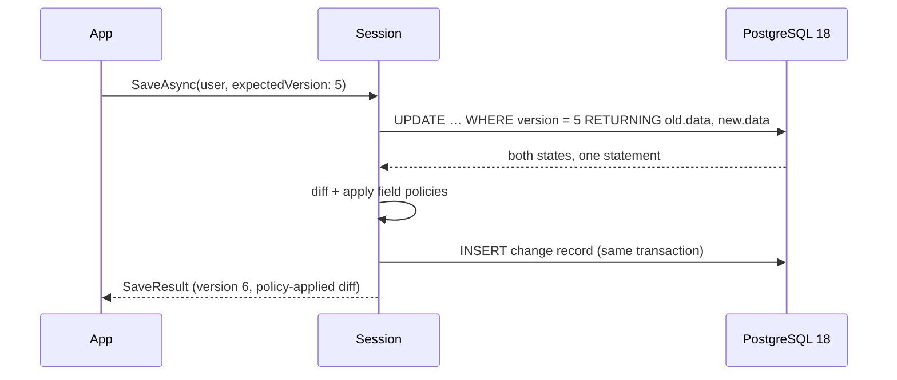

# Papuma Kernel — Technical Factsheet

Version `1.2.1` · Target framework .NET 10 · MIT licensed · reflects `master`, including
the changes listed under *Unreleased* in the CHANGELOG

Two persistence kernels for .NET, sharing one document-sourced model:
`Papuma.Kernel` (requires PostgreSQL ≥ 18, for servers) and
`Papuma.Kernel.Local` (SQLite, embedded, no server — §8). Plain C# records are
stored as JSON documents; the document is the source of truth. In the same
transaction as each write, the kernel derives a reversible field-level change
record and applies declared field policies to it. A processing engine delivers
those records to application handlers in strict order, with persisted
checkpoints. It is not event sourcing (state is stored, not folded from
events), not an ORM, and provides no query DSL.

The scope of the library is deliberately narrow: it owns the write path, the
derived feed, and the delivery guarantees. Read models, search indexes, message
buses and workflow logic are the application's, built on the primitives below.

Sections 1–7 describe `Papuma.Kernel` (Postgres). §8 covers
`Papuma.Kernel.Local` (SQLite) — what's shared code (not a lookalike
reimplementation) versus what's deliberately different, and why.

---

## 1. The write path

A write is a single SQL statement. PostgreSQL 18's `RETURNING OLD, NEW` returns
the row state before and after the mutation in one operation, so the diff is
computed from values the database itself produced within the transaction. The
change record is inserted in the same transaction as the document mutation.



Three properties follow directly from this, rather than from added machinery:

- **Optimistic concurrency is an invariant.** `SaveAsync` requires an
  `expectedVersion`; a mismatch raises a typed `ConcurrencyException`. Lost
  updates are not detected-and-recovered, they are structurally excluded.
- **The feed is gapless and correctly ordered.** Ordering derives from the
  document version and the feed sequence under MVCC, not from timestamps or
  heuristics. There is no separate outbox to keep in sync and no dual-write.
- **The change history is also the audit log.** Each record carries actor,
  timestamp, correlation and causation identifiers, and a reversible diff.

---

## 2. What the library provides

| Area | Contents |
|---|---|
| Write primitives | `SaveAsync`/`DeleteAsync` with mandatory version check; single-statement patches (`Set`/`Remove`/`Increment`); set-based bulk operations (`PatchWhereAsync`/`DeleteWhereAsync`); append-only `RollbackAsync`; an atomic bounded counter (validated under 12-way concurrency). Every write result exposes the persisted document (`SaveResult.GetDocument<T>()`) — e.g. the value an `Increment` produced, without a second read. |
| Keys | Unique and lookup keys declared in the metamodel, materialized as partial expression indexes — single-field or composite over several fields (`UniqueKey(x => new { x.ProjectId, x.Number })`, ADR-020). A violation is a typed `UniqueKeyViolationException`. |
| Reads | `LoadAsync`/`LoadByKeyAsync` over declared, indexed keys (composite keys with one value per component) — transactionally consistent, no feed involvement. `LoadMaskedAsync` returns a document with field policies applied on read (ADR-016). Derived and aggregated reads are projections; SQL views over the JSONB store are a supported but gated read lens. |
| Processing engine | Strict per-handler ordering; persisted per-handler checkpoints (`papuma.checkpoint`); retry with backoff; poison-record skip with alarm; rebuild via checkpoint reset + replay; multi-instance leader failover via `FOR UPDATE SKIP LOCKED`. NOTIFY-driven with polling as the correctness floor. No external coordinator. |
| Multi-tenancy | Two independent isolation layers: explicit scope predicates in every query, plus PostgreSQL row-level security; fail-closed. Every session is scope-bound (`Platform` or `Tenant(id)`; GUID tenant ids via `Tenant(Guid)`). Application tables in the same database join the row-level security through `papuma.scope_visible`/`scope_writable` (ADR-019). |
| Field policies | `Redact` / `Hash` / `Reference` / `DoNotTrack`, applied inside the write transaction. Sensitive values do not enter the feed, logs, traces, or downstream consumers. The same policy definition is enforced on the masked read path. |
| GDPR tooling | Art. 30 data inventory built from the metamodel; Art. 15/20 subject export as one consistent snapshot; history redaction with a mandatory audit trail for Art. 17 cases. |
| Event log | First-class facts (e.g. `UserLoggedIn`) alongside state changes — same transaction, same policies, per-type retention. Events have no upcasting; a new shape is a new type. |
| Schema evolution | Lazy upcasting with version guards. A class change is a registered `Upcast(fromVersion, …)` function; additive changes need none. Persistence follows on the next save. |
| Observability | BCL `Meter` + `ActivitySource` (no vendor SDK), OpenTelemetry-compatible; feed-lag health check; trace propagation from request to projection; an embedded dashboard via `MapPapumaDashboard()`. |
| MCP surface | `Papuma.Kernel.Mcp` exposes the diagnostics APIs and scope-bound, policy-masked reads (read-only, opt-in per document type), over stateless Streamable HTTP or stdio. The policy-minimized feed is low-PII by construction. |
| Testing | `Papuma.Kernel.Testing`: a PostgreSQL 18 test database (Testcontainers or an existing server) with a non-superuser application role, so tests exercise row-level security; `DrainAsync()` runs feed handlers deterministically and fails on handler errors. Test-framework agnostic (ADR-021). |
| F# | `Papuma.Kernel.FSharp`: `Result`-returning writes for the expected outcomes and an `IAsyncDisposable`-safe session runner; patches and keys take plain F# lambdas. Works with either kernel. |

---

## 3. Measured performance

Commodity hardware (i7, local PostgreSQL 18 container). The probes are in
`benchmarks/` and reproducible.

| Metric | Value |
|---|---:|
| Write path, 4 parallel sessions (incl. diff + change record) | ~900 saves/s |
| Feed delivery overhead per change | ~37 µs |
| Projection handler, 1 SQL upsert per change | ~1,400 changes/s |
| Diff of a 1,000-field document | ~0.3 ms |
| Test suite against real PostgreSQL 18 (per CI build) | 207, passing |

Known scaling limits are documented alongside the metric that detects each and
the intended mitigation (`docs/concepts.md §14`) rather than left implicit.

---

## 4. Interoperability

- **Cross-language consumers.** The feed is two documented Postgres tables with a
  stable JSONB wire format; a Python or Go consumer is roughly 50 lines. Runnable
  examples ship in the samples.
- **Message buses.** The derived feed is a transactional outbox. A bridge handler
  publishes to NATS/JetStream, Kafka or webhooks; at-least-once delivery becomes
  effectively-once with a dedup key on the consumer.
- **SQL reporting.** Views over the JSONB store serve reporting and BI without an
  export pipeline, subject to `security_invoker = on` and the read-lens
  conditions in `concepts.md §16`.
- **Read models in the same database.** Projection tables keep the kernel's
  row-level security via the ADR-019 scope functions — a query that forgets its
  tenant filter returns nothing rather than another tenant's rows.

---

## 5. Boundaries

- **Not event sourcing.** State is stored directly and the feed is derived. If
  state must be defined by an event fold, this is the wrong tool.
- **Not an ORM or query DSL.** Lookups run over declared, indexed keys; richer
  queries are projections or SQL views. The boundary is enforced, not advisory.
- **No database abstraction layer.** `Papuma.Kernel` requires PostgreSQL ≥ 18;
  the single-statement write path depends on `RETURNING OLD/NEW`, exploited
  without a compatibility shim. `Papuma.Kernel.Local` (§8) is a second,
  independent implementation of the same model against SQLite — not this
  kernel abstracted over a storage interface.
- **Not a workflow engine.** Durable state machines, human-in-the-loop steps and
  timers are documented patterns over the primitives (with sample code); the
  workflow definition stays application code.

---

## 6. Maturity (`Papuma.Kernel`)

The design is complete: 13 implementation phases, 21 ADRs, each identified risk
closed with a test or a measurement; the full suite runs against real
PostgreSQL 18 on every CI build. It has **not yet run production traffic**.
Suitable today for internal line-of-business systems and new products by teams
that control their PostgreSQL version. For regulated or mission-critical
workloads, run a pilot first; the observability needed to evaluate it is built
in.

`Papuma.Kernel.Local` is newer and earlier-stage: full API parity with the
Postgres kernel's write/read/patch/GDPR/rollback/feed-processing surface, 62
tests green against the real SQLite engine (including empirically pinned
driver behavior — WAL mode, busy timeouts, expression-index matching — not
assumed), but zero production hours and no throughput measurements yet, only
correctness. See §8.4.

---

## 7. Minimal setup

```csharp
builder.Services
    .AddPapumaKernel(o =>
    {
        o.ConnectionString = config.GetConnectionString("papuma");
        o.Model(m => m
            .Document<User>(d => d.UniqueKey(x => x.Email))
            .Event<UserLoggedIn>(e => e.Retention(TimeSpan.FromDays(90))));
    })
    .AddChangeHandler<UserProjection>();

await using var session = store.OpenSession(ScopeContext.Tenant("acme"));
await session.SaveAsync(user, expectedVersion: 0);
await session.AppendAsync(new UserLoggedIn(user.Id, "web"));
await session.CommitAsync();
```

Schema, indexes and row-level security are created idempotently at startup; there
is no separate migration step.

---

## 8. `Papuma.Kernel.Local` — SQLite, no server

`Papuma.Kernel.Local` is a second, independent implementation of the same
document-sourced model against SQLite, for the deployment shape where
PostgreSQL is the wrong tool rather than a smaller version of it: a
single-writer embedded file, no daemon, no port, no server process for the
application's users to install or operate.

### 8.1 What's shared code, not a lookalike

`Papuma.Kernel.Core` — extracted once, referenced by both kernels, embedded
in whichever package is installed — supplies the diff engine, the field
policy engine, the model/validation layer, GDPR redaction logic, the
storage-neutral half of feed processing (`IChangeHandler`/`IEventHandler`,
processor options, failure/lag types), and `KernelDiagnostics`
(`Meter`/`ActivitySource`). Both kernels' metrics and traces land in the same
OpenTelemetry pipeline; this is one codebase for that surface, not two
implementations agreeing by convention.

What each kernel implements independently against its own engine: the
session write path, patch application, schema management, and feed
processing loop — described in §8.2.

### 8.2 What's deliberately different

A single-writer embedded store doesn't need the machinery that exists to
solve multi-writer problems:

| | Postgres kernel | SQLite kernel |
|---|---|---|
| Atomic old/new capture | one `RETURNING OLD/NEW` statement | `SELECT` + version-checked `UPDATE...RETURNING` — two statements; still atomic because the transaction is exclusive, nothing can interleave |
| Feed wakeup | `LISTEN`/`NOTIFY`, network round trip | in-process `SqliteChangeNotifier` (bounded channel), no network involved |
| Gapless-read handling | `txid`/snapshot filtering (ADR-010) — solves a multi-writer commit-order problem | not needed — one writer, no commit-order to reconcile |
| Row isolation | explicit scope predicates **plus** PostgreSQL row-level security | explicit scope predicates only — no second process to defend against |
| Leader coordination | `FOR UPDATE SKIP LOCKED` across concurrent processor instances | not needed — a single-writer store has exactly one instance |
| Patch application | generated `jsonb_set`/`#-` SQL expressions | applied in-process against the loaded JSON (`JsonPatchApplier`), then written back |
| Declared-key indexes | `data #>> '{path,segments}'` expression index, one expression per component of a composite key | `json_extract(data,'$.path')` expression index (likewise per component), with the path interpolated as a SQL literal, not bound as a parameter — SQLite's planner only matches an expression index when the query text is identical to the index definition |
| Unique-violation detection | structured Postgres constraint name | `SqliteErrorCode == 19` + regex-extracted index name from `ex.Message` (no structured constraint-name property in the driver) |

Two correctness details worth calling out because they were bugs, not design
choices: SQLite's `json_extract` returns the native storage class (INTEGER/
REAL/0-1) for numbers and booleans, not text, so comparisons against a
declared key must switch on the CLR type of the compared value rather than
always binding text; and the expression index above only fires when the
query's JSON path is textually identical to the index's, which is why the
path is interpolated as a literal (each segment still validated through the
same `InputValidator` discipline the DDL uses) rather than passed as a query
parameter. Both are covered by regression tests
(`SqliteSpikeTests`, `SqliteNumericKeyTests`).

Every one of these is documented with its reasoning, not just the diff, in
[docs/analyses/local-kernel-sqlite-sibling.md](analyses/local-kernel-sqlite-sibling.md).

### 8.3 Minimal setup

```csharp
builder.Services
    .AddPapumaKernelLocal(o =>
    {
        o.DbPath = Path.Combine(appDataDir, "app.db");
        o.Model(m => m.Document<User>(d => d.UniqueKey(x => x.Email)));
    })
    .AddChangeHandler<UserProjection>();

await using var session = store.OpenSession(ScopeContext.Tenant("local"));
await session.SaveAsync(user, expectedVersion: 0);
await session.CommitAsync();
```

Every connection is opened through a shared `SqliteConnectionFactory` that
applies `PRAGMA journal_mode = 'WAL'` and a 5-second `busy_timeout`, so a
background feed processor writing doesn't block the UI reading — verified
empirically (`SqliteConnectionFactoryTests`), not assumed.

### 8.4 Maturity (`Papuma.Kernel.Local`)

See §6 — same statement, not repeated with different numbers.

**Packages:** `Papuma.Kernel` (Postgres) · `Papuma.Kernel.Local` (SQLite) ·
`Papuma.Kernel.AspNetCore` · `Papuma.Kernel.Mcp` · `Papuma.Kernel.Testing` ·
`Papuma.Kernel.FSharp`
**Documentation:** shipped in the package under `docs/` and at
[github.com/papumabiz/Papuma.Kernel](https://github.com/papumabiz/Papuma.Kernel);
start with `docs/getting-started.md` (Postgres) or
`docs/analyses/local-kernel-sqlite-sibling.md` (SQLite).
