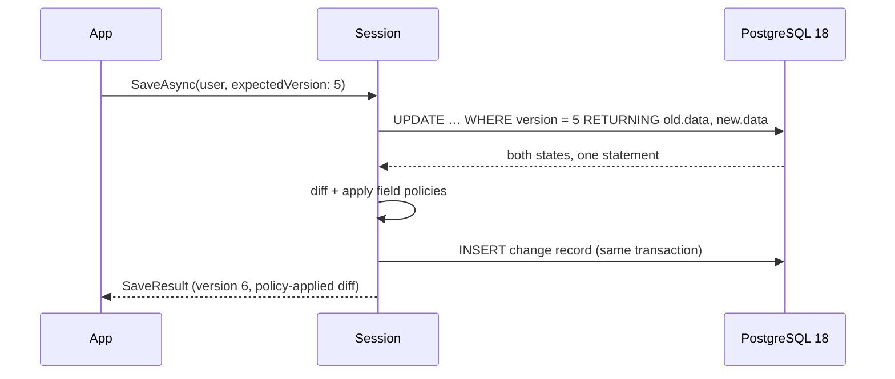

# Papuma.Kernel — Technical Factsheet

Version `1.0.2` · Target framework .NET 10 · Requires PostgreSQL ≥ 18 · MIT licensed

A PostgreSQL-native persistence kernel for .NET. Plain C# records are stored as
JSON documents; the document is the source of truth. In the same transaction as
each write, the kernel derives a reversible field-level change record and applies
declared field policies to it. A processing engine delivers those records to
application handlers in strict order, with persisted checkpoints. It is not event
sourcing (state is stored, not folded from events), not an ORM, and provides no
query DSL.

The scope of the library is deliberately narrow: it owns the write path, the
derived feed, and the delivery guarantees. Read models, search indexes, message
buses and workflow logic are the application's, built on the primitives below.

---

## 1. The write path

A write is a single SQL statement. PostgreSQL 18's `RETURNING OLD, NEW` returns
the row state before and after the mutation in one operation, so the diff is
computed from values the database itself produced within the transaction. The
change record is inserted in the same transaction as the document mutation.



Three properties follow directly from this, rather than from added machinery:

- **Optimistic concurrency is an invariant.** `SaveAsync` requires an
  `expectedVersion`; a mismatch raises a typed `ConcurrencyException`. Lost
  updates are not detected-and-recovered, they are structurally excluded.
- **The feed is gapless and correctly ordered.** Ordering derives from the
  document version and the feed sequence under MVCC, not from timestamps or
  heuristics. There is no separate outbox to keep in sync and no dual-write.
- **The change history is also the audit log.** Each record carries actor,
  timestamp, correlation and causation identifiers, and a reversible diff.

---

## 2. What the library provides

| Area | Contents |
|---|---|
| Write primitives | `SaveAsync`/`DeleteAsync` with mandatory version check; single-statement patches (`Set`/`Remove`/`Increment`); set-based bulk operations (`PatchWhereAsync`/`DeleteWhereAsync`); append-only `RollbackAsync`; an atomic bounded counter (validated under 12-way concurrency). |
| Reads | `LoadAsync`/`LoadByKeyAsync` over declared, indexed keys — transactionally consistent, no feed involvement. `LoadMaskedAsync` returns a document with field policies applied on read (ADR-016). Derived and aggregated reads are projections; SQL views over the JSONB store are a supported but gated read lens. |
| Processing engine | Strict per-handler ordering; persisted per-handler checkpoints (`papuma.checkpoint`); retry with backoff; poison-record skip with alarm; rebuild via checkpoint reset + replay; multi-instance leader failover via `FOR UPDATE SKIP LOCKED`. NOTIFY-driven with polling as the correctness floor. No external coordinator. |
| Multi-tenancy | Two independent isolation layers: explicit scope predicates in every query, plus PostgreSQL row-level security. Every session is scope-bound (`Platform` or `Tenant(id)`). |
| Field policies | `Redact` / `Hash` / `Reference` / `DoNotTrack`, applied inside the write transaction. Sensitive values do not enter the feed, logs, traces, or downstream consumers. The same policy definition is enforced on the masked read path. |
| GDPR tooling | Art. 30 data inventory built from the metamodel; Art. 15/20 subject export as one consistent snapshot; history redaction with a mandatory audit trail for Art. 17 cases. |
| Event log | First-class facts (e.g. `UserLoggedIn`) alongside state changes — same transaction, same policies, per-type retention. Events have no upcasting; a new shape is a new type. |
| Schema evolution | Lazy upcasting with version guards. A class change is a registered `Upcast(fromVersion, …)` function; additive changes need none. Persistence follows on the next save. |
| Observability | BCL `Meter` + `ActivitySource` (no vendor SDK), OpenTelemetry-compatible; feed-lag health check; trace propagation from request to projection; an embedded dashboard via `MapPapumaDashboard()`. |
| MCP surface | `Papuma.Kernel.Mcp` exposes the diagnostics APIs and scope-bound, policy-masked reads (read-only, opt-in per document type). The policy-minimized feed is low-PII by construction. |

---

## 3. Measured performance

Commodity hardware (i7, local PostgreSQL 18 container). The probes are in
`benchmarks/` and reproducible.

| Metric | Value |
|---|---:|
| Write path, 4 parallel sessions (incl. diff + change record) | ~900 saves/s |
| Feed delivery overhead per change | ~37 µs |
| Projection handler, 1 SQL upsert per change | ~1,400 changes/s |
| Diff of a 1,000-field document | ~0.3 ms |
| Integration tests against real PostgreSQL 18 | 167, passing |

Known scaling limits are documented alongside the metric that detects each and
the intended mitigation (`docs/vNEXT/concepts.md §14`) rather than left implicit.

---

## 4. Interoperability

- **Cross-language consumers.** The feed is two documented Postgres tables with a
  stable JSONB wire format; a Python or Go consumer is roughly 50 lines. Runnable
  examples ship in the samples.
- **Message buses.** The derived feed is a transactional outbox. A bridge handler
  publishes to NATS/JetStream, Kafka or webhooks; at-least-once delivery becomes
  effectively-once with a dedup key on the consumer.
- **SQL reporting.** Views over the JSONB store serve reporting and BI without an
  export pipeline, subject to `security_invoker = on` and the read-lens
  conditions in `concepts.md §16`.

---

## 5. Boundaries

- **Not event sourcing.** State is stored directly and the feed is derived. If
  state must be defined by an event fold, this is the wrong tool.
- **Not an ORM or query DSL.** Lookups run over declared, indexed keys; richer
  queries are projections or SQL views. The boundary is enforced, not advisory.
- **PostgreSQL-specific.** PostgreSQL ≥ 18 is required; the single-statement write
  path depends on `RETURNING OLD/NEW`. There is no database abstraction layer.
- **Not a workflow engine.** Durable state machines, human-in-the-loop steps and
  timers are documented patterns over the primitives (with sample code); the
  workflow definition stays application code.

---

## 6. Maturity

The design is complete: 13 implementation phases, 16 ADRs, each identified risk
closed with a test or a measurement. It has **not yet run production traffic**.
Suitable today for internal line-of-business systems and new products by teams
that control their PostgreSQL version. For regulated or mission-critical
workloads, run a pilot first; the observability needed to evaluate it is built
in.

---

## 7. Minimal setup

```csharp
builder.Services
    .AddPapumaKernel(o =>
    {
        o.ConnectionString = config.GetConnectionString("papuma");
        o.Model(m => m
            .Document<User>(d => d.UniqueKey(x => x.Email))
            .Event<UserLoggedIn>(e => e.Retention(TimeSpan.FromDays(90))));
    })
    .AddChangeHandler<UserProjection>();

await using var session = store.OpenSession(ScopeContext.Tenant("acme"));
await session.SaveAsync(user, expectedVersion: 0);
await session.AppendAsync(new UserLoggedIn(user.Id, "web"));
await session.CommitAsync();
```

Schema, indexes and row-level security are created idempotently at startup; there
is no separate migration step.

**Packages:** `Papuma.Kernel` · `Papuma.Kernel.AspNetCore` · `Papuma.Kernel.Mcp`
**Documentation:** shipped in the package under `docs/` and at
[github.com/papumabiz/Papuma.Kernel](https://github.com/papumabiz/Papuma.Kernel);
start with `docs/vNEXT/getting-started.md`.
