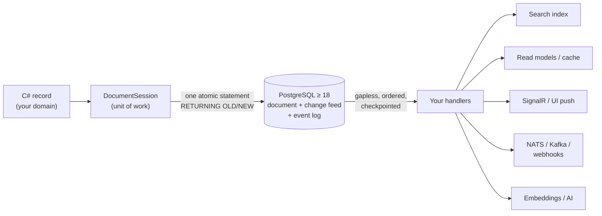
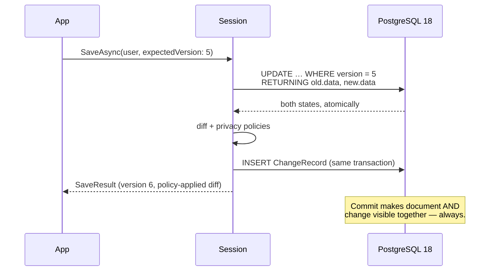
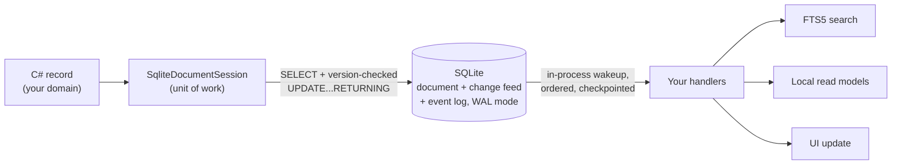

# Papuma Kernel

**Your documents are the truth. Everything else follows automatically.**

Two independent application kernels for .NET 10, sharing one model, each
exploiting its own storage engine without apology: **`Papuma.Kernel`**
(PostgreSQL ≥ 18, for servers) and **`Papuma.Kernel.Local`** (SQLite, for
single-writer desktop/mobile apps with no business running a database
server). Both give you what event sourcing promises — a complete, auditable
change history and reactive projections — without what event sourcing costs:
no replay obligation, no mandatory event modeling, no fight with GDPR. Store
plain C# objects as JSON documents; the kernel derives a reversible change
feed in the same transaction, applies your privacy policies before anything
is recorded, and delivers every change to your handlers exactly in order.

This factsheet leads with `Papuma.Kernel` (Postgres) — the diagrams, the
measured numbers, and most of the depth — because it's the more mature of
the two. `Papuma.Kernel.Local` gets its own section further down: same
promises, different engine, honestly labeled as the newer of the two.



---

## The one guarantee everything builds on

Every write is **one atomic statement**. PostgreSQL 18's `RETURNING OLD/NEW`
delivers the state before and after the change in the same operation — there is
no window in which the diff can lie, no outbox that can be forgotten, no
dual-write problem to patch over.



From this single primitive, the rest follows: optimistic concurrency as an
invariant (lost updates are impossible, conflicts are typed), a gapless feed
(MVCC snapshots, not heuristics), and a change history that doubles as your
audit log — every transition with actor, timestamp, correlation and a
reversible field diff.

---

## What ships in the box

| | |
|---|---|
| **Write primitives** | Save/Delete with mandatory version check · single-statement patches (`Set`/`Remove`/`Increment`) · set-based bulk operations · append-only rollback · the atomic bounded counter (never oversell — proven under 12-way concurrency) |
| **Multi-tenancy** | Two independent isolation layers: explicit scope predicates in every query **plus** PostgreSQL row-level security. An erasure in tenant A provably cannot touch tenant B. |
| **Privacy by construction** | Field policies (`Redact`/`Hash`/`Reference`/`DoNotTrack`) applied **inside the write transaction** — sensitive values never reach the feed, the logs, the traces, or your AI consumers. |
| **GDPR tooling** | Art.-30 data inventory from the metamodel · Art.-15/20 subject export (one consistent snapshot) · history redaction with mandatory audit trail for the Art.-17 edge cases |
| **Processing engine** | Strict per-handler ordering · persisted checkpoints · retry with backoff · poison handling · rebuild = one call · leader failover via `FOR UPDATE SKIP LOCKED` — no ZooKeeper, no extra infrastructure |
| **Event log** | First-class facts (`UserLoggedIn`) next to state changes, same transaction, same policies, per-type retention |
| **Schema evolution** | Lazy upcasting with version guards — class changes are a tested function, not a migration weekend |
| **Observability** | BCL `Meter` + `ActivitySource` (zero vendor dependencies) · OpenTelemetry-ready · feed-lag health check · trace propagation from request to projection · **embedded live dashboard** (`MapPapumaDashboard()`) for the day before Prometheus exists |
| **AI-ready** | MCP server over the diagnostics APIs **and scope-bound, policy-masked reads** (read-only by default) · agent playbook and docs shipped inside the NuGet package · the policy-minimized feed is safe LLM reading material by construction |

---

## Numbers, not adjectives

Measured on commodity hardware (i7, local PG-18 container; reusable probes in
`benchmarks/`):

| Metric | Measured |
|---|---:|
| Write path (4 parallel sessions, incl. diff + change record) | ~900 saves/s |
| Feed engine ceiling (delivery overhead per change) | ~37 µs |
| Realistic projection handler (1 SQL upsert per change) | ~1,400 changes/s |
| Diff engine, 1,000-field document | ~0.3 ms |
| Integration tests against real PostgreSQL 18 | 167, green |
| Architecture decision records | 16 |

Scaling limits are not hidden — they are documented with the metric that
detects them and the designed escape route for each
(`docs/vNEXT/concepts.md §14`).

---

## Plays well with everything

- **Any language can consume the feed** — it is two documented Postgres tables
  with a stable JSONB wire format; a Python or Go consumer is ~50 lines.
- **Event buses dock behind the feed** — the derived feed *is* a transactional
  outbox; the NATS/JetStream bridge (runnable in the sample) turns at-least-once
  into exactly-once with one line of dedup.
- **SQL stays a first-class citizen** — views over the JSONB store are a
  sanctioned read lens; reporting and BI need no export pipeline.
- **Three runnable samples** carry it from breadth to shape to reach: a
  mini-shop Minimal API exercising every concept (approval workflows with humans
  in the loop, saga compensation, inventory that cannot oversell, realtime UI
  push, the MCP endpoint and the dashboard); a set of event-modeled vertical
  slices (one Command/View/Automation each, with an infrastructure-free Decider
  test); and Python + Go feed consumers proving the cross-language wire format.

---

## What it deliberately is not

Honesty is cheaper than disappointment:

- **Not an ORM, not a query DSL.** Lookups run over declared, indexed keys;
  everything richer is a projection or a SQL view. This boundary is enforced,
  not just recommended.
- **Not event sourcing.** The document is the truth; the feed is derived. If
  you need event-defined state, you need a different product — and we say so.
- **Not one database-agnostic abstraction wearing two hats.** PostgreSQL ≥ 18
  is exploited without apology — the single-statement write path *is* the
  product. `Papuma.Kernel.Local` (SQLite, see below) is a second, independent
  implementation of the same model, not an abstraction layer this kernel
  hides behind.
- **Not a workflow/BPMN engine.** Durable state machines, human-in-the-loop
  tasks and timers are documented patterns on kernel primitives (with running
  sample code) — the workflow definition stays your code.

## Maturity, stated plainly

`1.0.2` — the design is complete (13 implementation phases, 16 ADRs,
every identified risk closed with tests or measurements), but it has **not yet
carried production traffic**. Best fit today: internal line-of-business
systems and new products built by teams that control their PostgreSQL version.
For regulated, mission-critical workloads: run a pilot first — the
observability to judge it is built in.

---

## `Papuma.Kernel.Local` — the same model, no server

Same documents, same reversible diffs, same change feed, same privacy
policies, same GDPR tooling, same schema-evolution story — built for the
deployment shape where PostgreSQL is the wrong tool, not a smaller version of
it: a single-writer SQLite file, opening in milliseconds, with no daemon, no
port, no installer step your users have to run.



What's identical to `Papuma.Kernel` (same code, `Papuma.Kernel.Core`, not two
implementations agreeing by convention): write primitives, field policies,
GDPR tooling, event log, schema upcasting, per-handler ordered/checkpointed/
retried feed delivery, and — genuinely shared, not a lookalike — the same
`Meter`/`ActivitySource` (`KernelDiagnostics` lives in Core too, so both
kernels' metrics/traces land in the same OTel pipeline). What's Postgres-only
in the table above: row-level security (multi-tenancy stays
scope-predicate-only on SQLite), leader failover across concurrent processor
instances (a single-writer store has exactly one), the embedded dashboard and
feed-lag health check (both live in `Papuma.Kernel.AspNetCore`, which has no
SQLite counterpart yet), and the MCP surface.

What's deliberately different, because a single-writer embedded store doesn't
need the machinery that solves multi-writer problems:

| | Postgres kernel | SQLite kernel |
|---|---|---|
| Atomic old/new capture | one `RETURNING OLD/NEW` statement | `SELECT` + version-checked `UPDATE...RETURNING` — two statements, same atomicity (the transaction is exclusive; nothing can interleave) |
| Feed wakeup | `LISTEN`/`NOTIFY`, network round trip | in-process `SqliteChangeNotifier`, no network involved |
| Gapless-read handling | `txid`/snapshot filtering (ADR-010) — solves a multi-writer commit-order problem | not needed — one writer, no commit-order to reconcile |
| Row isolation | explicit scope predicates **plus** Postgres row-level security | explicit scope predicates only — no second process to defend against |
| Patch application | generated `jsonb_set`/`#-` SQL expressions | applied in-process against the loaded JSON, then written back |

Every one of these is documented with the reasoning, not just the diff — see
[docs/analyses/local-kernel-sqlite-sibling.md](analyses/local-kernel-sqlite-sibling.md).

**Maturity, stated with the same honesty as above:** newer than the Postgres
kernel. Full API parity, **58 tests green against the real SQLite engine**
(including empirically pinned driver behavior — WAL mode, busy timeouts,
expression-index matching — not assumed), but no production hours yet and no
throughput benchmarks, only correctness. Right tool for local desktop/mobile
storage today; treat performance claims as unverified until measured the same
way the numbers above were.

```csharp
builder.Services
    .AddPapumaKernelLocal(o =>
    {
        o.DbPath = Path.Combine(appDataDir, "app.db");
        o.Model(m => m.Document<User>(d => d.UniqueKey(x => x.Email)));
    })
    .AddChangeHandler<UserProjection>();

await using var session = store.OpenSession(ScopeContext.Tenant("local"));
await session.SaveAsync(user, expectedVersion: 0);
await session.CommitAsync();
```

---

## Sixty seconds to running

```csharp
builder.Services
    .AddPapumaKernel(o =>
    {
        o.ConnectionString = config.GetConnectionString("papuma");
        o.Model(m => m
            .Document<User>(d => d.UniqueKey(x => x.Email))
            .Event<UserLoggedIn>(e => e.Retention(TimeSpan.FromDays(90))));
    })
    .AddChangeHandler<UserProjection>();

// Write — atomic, versioned, policy-applied, feed included:
await using var session = store.OpenSession(ScopeContext.Tenant("acme"));
await session.SaveAsync(user, expectedVersion: 0);
await session.AppendAsync(new UserLoggedIn(user.Id, "web"));
await session.CommitAsync();
```

Schema, indexes and row-level security are created idempotently at startup.
There is no migration step. There is no step two.

**Packages:** `Papuma.Kernel` (Postgres) · `Papuma.Kernel.Local` (SQLite) ·
`Papuma.Kernel.AspNetCore` · `Papuma.Kernel.Mcp`
**Docs:** shipped inside the package under `docs/`, and at
[github.com/papumabiz/Papuma.Kernel](https://github.com/papumabiz/Papuma.Kernel)
— start with `docs/vNEXT/getting-started.md` (Postgres) or
`docs/analyses/local-kernel-sqlite-sibling.md` (SQLite). MIT licensed.
